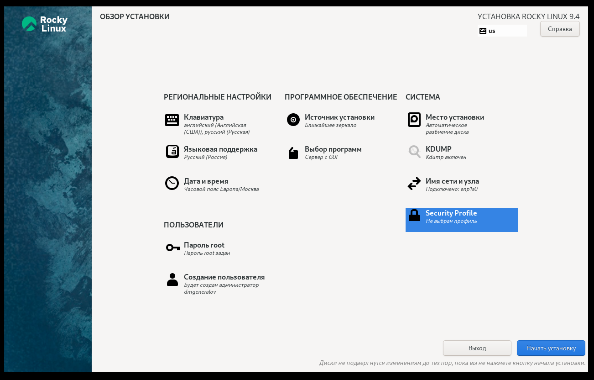

---
## Front matter
lang: ru-RU
title: Лабораторная работа 1
subtitle: Настройка виртуальной машины, Git и Markdown
author:
  - Генералов Даниил, 1032212280
institute:
  - Российский университет дружбы народов, Москва, Россия
date: "2024 год"

## i18n babel
babel-lang: russian
babel-otherlangs: english

## Formatting pdf
toc: false
toc-title: Содержание
slide_level: 2
aspectratio: 169
section-titles: true
theme: metropolis
header-includes:
 - \metroset{progressbar=frametitle,sectionpage=progressbar,numbering=fraction}
---

# Цель работы

Целью данной работы является приобретение практических навыков
установки операционной системы на виртуальную машину, настройки ми-
нимально необходимых для дальнейшей работы сервисов.

– Изучить идеологию и применение средств контроля версий.
– Освоить умения по работе с git.

Научиться оформлять отчёты с помощью легковесного языка разметки Markdown.

# Выполнение

## Виртуальная машина

{#fig:001 width=70%}

## Виртуальная машина

{#fig:002 width=70%}

## Виртуальная машина

{#fig:003 width=70%}

## Виртуальная машина

{#fig:004 width=70%}

## Виртуальная машина

{#fig:005 width=70%}

## Виртуальная машина

{#fig:010 width=70%}

## Виртуальная машина

{#fig:011 width=70%}

## Git

{#fig:006 width=70%}

## Git

{#fig:007 width=70%}

## Git

{#fig:008 width=70%}

## Markdown

{#fig:009 width=70%}

# Выводы

В рамках лабораторной работы мы настроили виртуальную машину для выполнения последующих работ --
но не на VirtualBox, а на Qemu/KVM.
Мы также создали репозиторий, в котором мы будем хранить отчеты,
и написали данный отчет и презентацию в Markdown.
