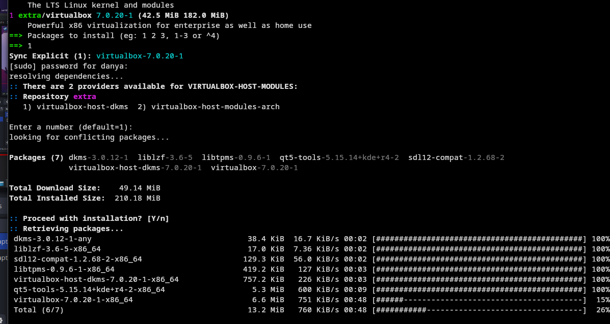
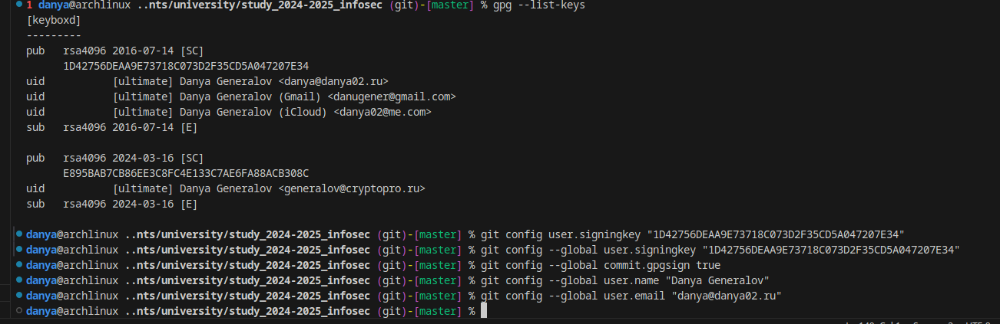
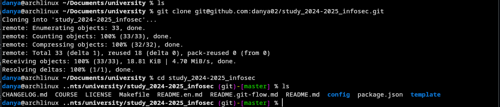
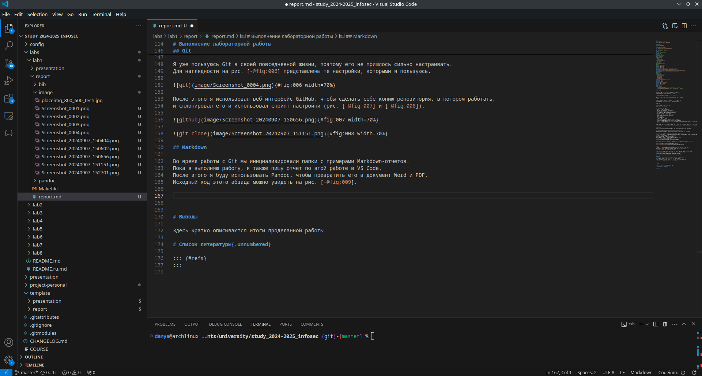

---
## Front matter
title: "Лабораторная работа 1"
author: "Генералов Даниил, 1032212280"

## Generic otions
lang: ru-RU
toc-title: "Содержание"

## Bibliography
bibliography: bib/cite.bib
csl: pandoc/csl/gost-r-7-0-5-2008-numeric.csl

## Pdf output format
toc: true # Table of contents
toc-depth: 2
lof: true # List of figures
lot: true # List of tables
fontsize: 12pt
linestretch: 1.5
papersize: a4
documentclass: scrreprt
## I18n polyglossia
polyglossia-lang:
  name: russian
  options:
	- spelling=modern
	- babelshorthands=true
polyglossia-otherlangs:
  name: english
## I18n babel
babel-lang: russian
babel-otherlangs: english
## Fonts
mainfont: IBM Plex Serif
romanfont: IBM Plex Serif
sansfont: IBM Plex Sans
monofont: IBM Plex Mono
mathfont: STIX Two Math
mainfontoptions: Ligatures=Common,Ligatures=TeX,Scale=0.94
romanfontoptions: Ligatures=Common,Ligatures=TeX,Scale=0.94
sansfontoptions: Ligatures=Common,Ligatures=TeX,Scale=MatchLowercase,Scale=0.94
monofontoptions: Scale=MatchLowercase,Scale=0.94,FakeStretch=0.9
mathfontoptions:
## Biblatex
biblatex: true
biblio-style: "gost-numeric"
biblatexoptions:
  - parentracker=true
  - backend=biber
  - hyperref=auto
  - language=auto
  - autolang=other*
  - citestyle=gost-numeric
## Pandoc-crossref LaTeX customization
figureTitle: "Рис."
tableTitle: "Таблица"
listingTitle: "Листинг"
lofTitle: "Список иллюстраций"
lotTitle: "Список таблиц"
lolTitle: "Листинги"
## Misc options
indent: true
header-includes:
  - \usepackage{indentfirst}
  - \usepackage{float} # keep figures where there are in the text
  - \floatplacement{figure}{H} # keep figures where there are in the text
---

# Цель работы

Целью данной работы является приобретение практических навыков
установки операционной системы на виртуальную машину, настройки ми-
нимально необходимых для дальнейшей работы сервисов.

– Изучить идеологию и применение средств контроля версий.
– Освоить умения по работе с git.

Научиться оформлять отчёты с помощью легковесного языка разметки Markdown.

# Задание

Дождитесь загрузки графического окружения и откройте терминал. В окне
терминала проанализируйте последовательность загрузки системы, выпол-
нив команду dmesg. Можно просто просмотреть вывод этой команды:

dmesg | less

Можно использовать поиск с помощью grep:

dmesg | grep -i "то, что ищем"

Получите следующую информацию.

1. Версия ядра Linux (Linux version).
2. Частота процессора (Detected Mhz processor).
3. Модель процессора (CPU0).
4. Объем доступной оперативной памяти (Memory available).
5. Тип обнаруженного гипервизора (Hypervisor detected).
6. Тип файловой системы корневого раздела.
7. Последовательность монтирования файловых систем.

– Создать базовую конфигурацию для работы с git.
– Создать ключ SSH.
– Создать ключ PGP.
– Настроить подписи git.
– Зарегистрироваться на Github.
– Создать локальный каталог для выполнения заданий по предмету.

– Сделайте отчёт по предыдущей лабораторной работе в формате Markdown.
– В качестве отчёта просьба предоставить отчёты в 3 форматах: pdf, docx и md (в архиве, поскольку он должен содержать скриншоты, Makefile и т.д.)

# Выполнение лабораторной работы

Первая лабораторная работа всегда посвещена настройке окружения, в котором мы будем выполнять все остальные лабораторные работы.
В рамках этой работы мы настраиваем виртуальную машину на VirtualBox, настраиваем Git и пишем об этом в Markdown.

## VirtualBox

Сначала мы устанавливаем VirtualBox на компьютер. Это делается одной командой (рис. [-@fig:001]).

{#fig:001 width=70%}

Однако при запуске VirtualBox произошла проблема, связанная с модулями ядра (рис. [-@fig:002]).

{#fig:002 width=70%}

Поскольку нам не требуются продвинутые функции VirtualBox, а у меня на машине успешно работает virt-manager (KVM/Qemu),
то установка виртуальной машины будет происходить там.
К счастью, установка OS там не сложнее, чем в VirtualBox:
сначала указывается путь к ISO (рис. [-@fig:003]),
затем -- параметры системы вроде размера оперативной памяти и диска,
и после этого виртуальная машина запускается.

{#fig:003 width=70%}

После этого открывается установщик, где надо применить все настройки для нашей новой виртуальной машины.
Здесь мы используем имена из соглашения об именовании (рис. [-@fig:004] и [-@fig:005]).

{#fig:004 width=70%}

{#fig:005 width=70%}

После этого мы запускаем установку, и через некоторое время машина перезагружается,
где мы можем настроить имя машины (потому что оно по умолчанию не задано, рис. [-@fig:010]).

{#fig:010 width=70%}

После этого можно получить всю информацию,
которую требуется узнать из вывода dmesg (рис. [-@fig:011]).

{#fig:011 width=70%}

## Git

Я уже пользуюсь Git в своей повседневной жизни, поэтому его не пришлось сильно настраивать.
Для наглядности на рис. [-@fig:006] представлены те настройки, которыми я пользуюсь.

{#fig:006 width=70%}

После этого я использовал веб-интерфейс GitHub, чтобы сделать себе копию репозитория, в котором работать,
и склонировал его и использовал скрипт настройки (рис. [-@fig:007] и [-@fig:008]).

{#fig:007 width=70%}

{#fig:008 width=70%}

## Markdown

Во время работы с Git мы инициализировали папки с примерами Markdown-отчетов. 
Пока я выполняю работу, я также пишу отчет по этой работе в VS Code.
После этого я буду использовать Pandoc, чтобы превратить его в документ Word и PDF.
Исходный код этого абзаца можно увидеть на рис. [-@fig:009].

{#fig:009 width=70%}

# Выводы

В рамках лабораторной работы мы настроили виртуальную машину для выполнения последующих работ --
но не на VirtualBox, а на Qemu/KVM.
Мы также создали репозиторий, в котором мы будем хранить отчеты,
и написали данный отчет и презентацию в Markdown.

