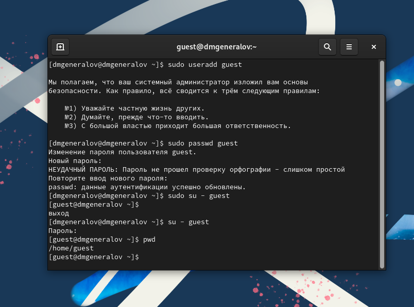
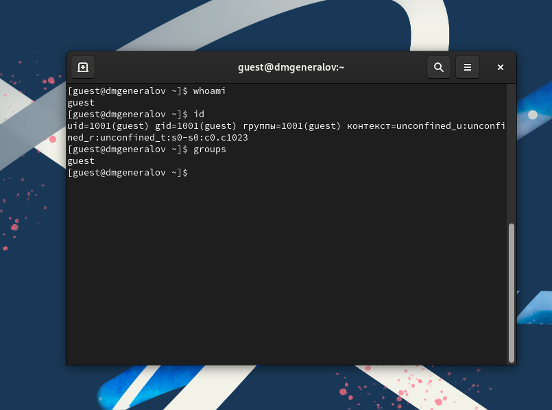
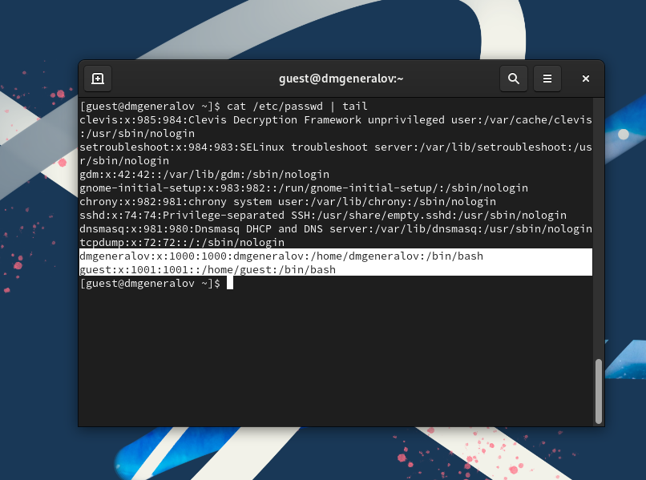
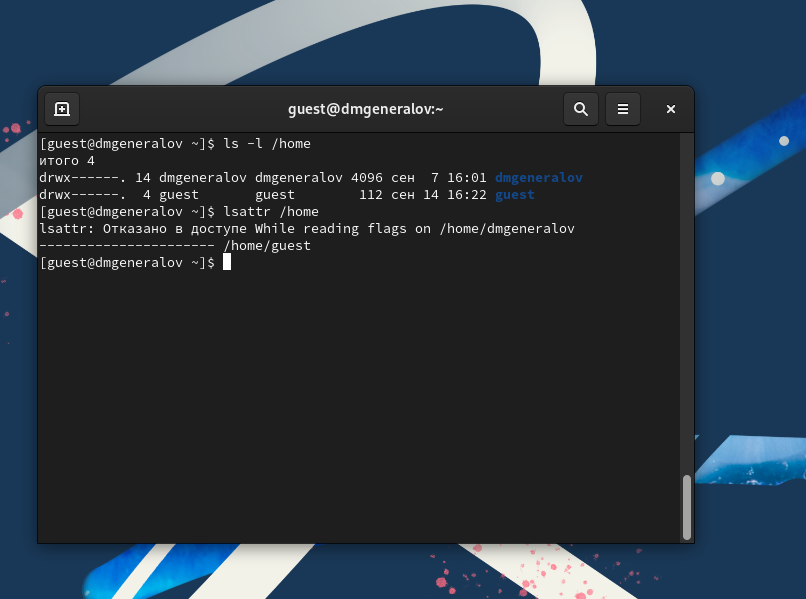
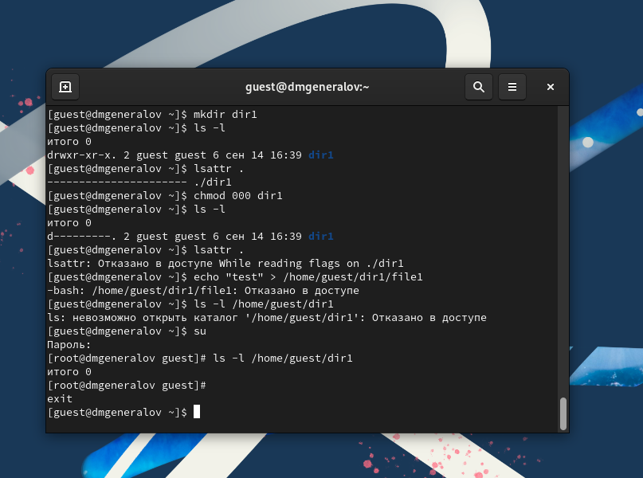

---
## Front matter
lang: ru-RU
title: Лабораторная работа 2
author:
  - Генералов Даниил, 1032212280
institute:
  - Российский университет дружбы народов, Москва, Россия
date: 2024 г.

## i18n babel
babel-lang: russian
babel-otherlangs: english

## Formatting pdf
toc: false
toc-title: Содержание
slide_level: 2
aspectratio: 169
section-titles: true
theme: metropolis
header-includes:
 - \metroset{progressbar=frametitle,sectionpage=progressbar,numbering=fraction}
---

# Задание

Получение практических навыков работы в консоли с атрибутами файлов, закрепление теоретических основ дискреционного разграничения доступа в современных системах с открытым кодом на базе ОС Linux.

Постарайтесь последовательно выполнить все пункты, занося ваши ответы на поставленные вопросы и замечания в отчёт.

# Выполнение

## useradd

{#fig:001 width=70%}

## whoami

{#fig:002 width=70%}

## /etc/passwd

{#fig:003 width=70%}

## ls /home

{#fig:004 width=70%}

## mkdir/chmod

{#fig:005 width=70%}

## Права доступа

Права директории | Права файла | Создание файла | Удаление файла | Запись в файл | Чтение файла | Смена директории | Просмотр файлов в директории | Переименование файла | Смена атрибутов файла
---|---|---|---|---|---|---|---|---|---
d--------- (000) | ---------- (000) | - | - | - | - | - | - | - | -
d--x------ (100) | ---x------ (100) | - | - | - | - | + | - | - | +
d-w------- (200) | --w------- (200) | - | - | + | - | - | - | - | -
d-wx------ (300) | --wx------ (300) | + | + | + | - | + | - | + | +
dr-------- (400) | -r-------- (400) | - | - | - | + | - | - | - | -
dr-x------ (500) | -r-x------ (500) | - | - | - | + | + | + | - | -
drw------- (600) | -rw------- (600) | - | - | + | + | - | - | - | -
drwx------ (700) | -rwx------ (700) | + | + | + | + | + | + | + | +

## Минимальные права

Операция | Права на директорию | Права на файл
---|---|---
Создание файла         | -wx | ???
Удаление файла         | -wx | ---
Чтение файла           | --x | r--
Запись в файл          | --x | -w-
Переименование файла   | -wx | ---
Создание поддиректории | -wx | ???
Удаление поддиректории | -wx | ???

# Выводы

Мы изучили, как использовать базовый дискреционный контроль доступа в Linux,
и определили, какие аттрибуты позволяют выполнять какие действия над папками или файлами.
