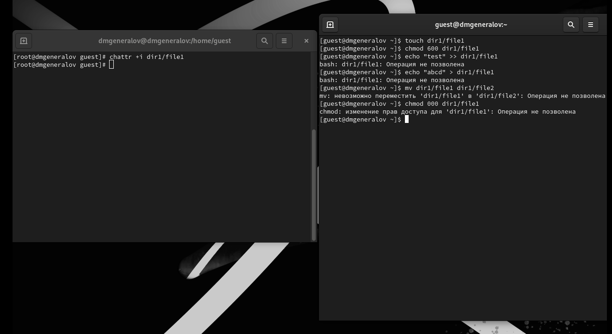

---
## Front matter
lang: ru-RU
title: Лабораторная работа 4
author:
  - Генералов Даниил, 1032212280
institute:
  - Российский университет дружбы народов, Москва, Россия
date: 2024 г.

## i18n babel
babel-lang: russian
babel-otherlangs: english

## Formatting pdf
toc: false
toc-title: Содержание
slide_level: 2
aspectratio: 169
section-titles: true
theme: metropolis
header-includes:
 - \metroset{progressbar=frametitle,sectionpage=progressbar,numbering=fraction}
---

# Задание

Получение практических навыков работы в консоли с расширенными
атрибутами файлов.

# Выполнение

## chattr

{#fig:001 width=70%}

## chattr

{#fig:002 width=70%}

# Выводы

В этой лабораторной работе мы познакомились с флагами `a` и `i` --
расширенными флагами атрибутов файлов, которые позволяют добавить дополнительные ограничения на использование файлов,
помимо стандартных прав доступа.
