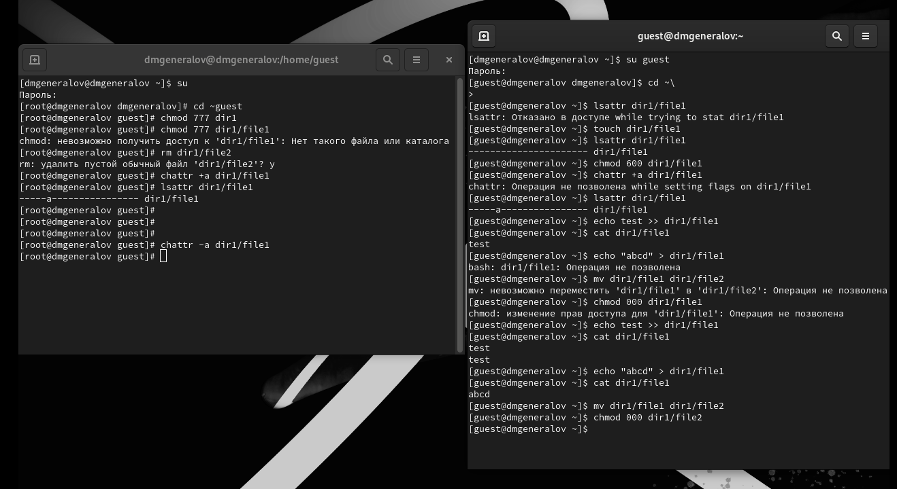
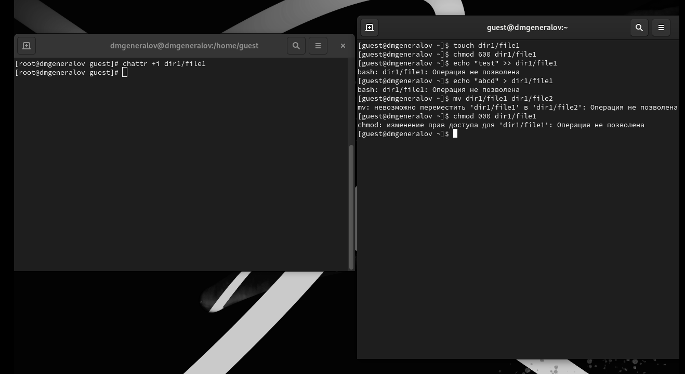

---
## Front matter
title: "Отчет по лабораторной работе 4"
author: "Даниил Генералов, 1032212280"

## Generic otions
lang: ru-RU
toc-title: "Содержание"

## Bibliography
bibliography: bib/cite.bib
csl: pandoc/csl/gost-r-7-0-5-2008-numeric.csl

## Pdf output format
toc: true # Table of contents
toc-depth: 2
lof: true # List of figures
lot: true # List of tables
fontsize: 12pt
linestretch: 1.5
papersize: a4
documentclass: scrreprt
## I18n polyglossia
polyglossia-lang:
  name: russian
  options:
  - spelling=modern
  - babelshorthands=true
polyglossia-otherlangs:
  name: english
## I18n babel
babel-lang: russian
babel-otherlangs: english
## Fonts
mainfont: IBM Plex Serif
romanfont: IBM Plex Serif
sansfont: IBM Plex Sans
monofont: IBM Plex Mono
mathfont: STIX Two Math
mainfontoptions: Ligatures=Common,Ligatures=TeX,Scale=0.94
romanfontoptions: Ligatures=Common,Ligatures=TeX,Scale=0.94
sansfontoptions: Ligatures=Common,Ligatures=TeX,Scale=MatchLowercase,Scale=0.94
monofontoptions: Scale=MatchLowercase,Scale=0.94,FakeStretch=0.9
mathfontoptions:
## Biblatex
biblatex: true
biblio-style: "gost-numeric"
biblatexoptions:
  - parentracker=true
  - backend=biber
  - hyperref=auto
  - language=auto
  - autolang=other*
  - citestyle=gost-numeric
## Pandoc-crossref LaTeX customization
figureTitle: "Рис."
tableTitle: "Таблица"
listingTitle: "Листинг"
lofTitle: "Список иллюстраций"
lotTitle: "Список таблиц"
lolTitle: "Листинги"
## Misc options
indent: true
header-includes:
  - \usepackage{indentfirst}
  - \usepackage{float} # keep figures where there are in the text
  - \floatplacement{figure}{H} # keep figures where there are in the text
---

# Цель работы

Получение практических навыков работы в консоли с расширенными
атрибутами файлов.

# Выполнение лабораторной работы

В этой лабораторной работе мы работаем с флагами `a` и `i` для файлов.

Сначала мы разбираемся с флагом `a`. От имени суперпользователя мы создаем файл `~guest/dir1/file1`,
а затем добавляем ему флаг `a` с помощью команды `chattr +a file1`.
Затем от имени пользователя `guest` мы можем выполнять только дописывание в этот файл:
мы не можем перезаписать его содержимое целиком, не можем переименовать его и не можем изменить свои собственные разрешения.
Все эти операции мы можем делать, когда этот флаг после этого снимается,
что можно увидеть на рис. [-@fig:001].

{#fig:001 width=70%}

После этого мы делаем аналогичные эксперименты с флагом `i`.
На этот раз никакие из операций не возможно выполнять, что можно увидеть на рис. [-@fig:002].

{#fig:002 width=70%}

Это связано с тем, что флаг `a` значит `append`, и он позволяет открывать файл только для дописывания в конец -- любые другие операции модификации запрещены.
Флаг `i` значит `immutable`, что значит, что этот файл нельзя изменить никаким способом, в том числе записать в него, переименовать его или изменить его аттрибуты никому кроме суперпользователя.

# Выводы

В этой лабораторной работе мы познакомились с флагами `a` и `i` --
расширенными флагами атрибутов файлов, которые позволяют добавить дополнительные ограничения на использование файлов,
помимо стандартных прав доступа.
