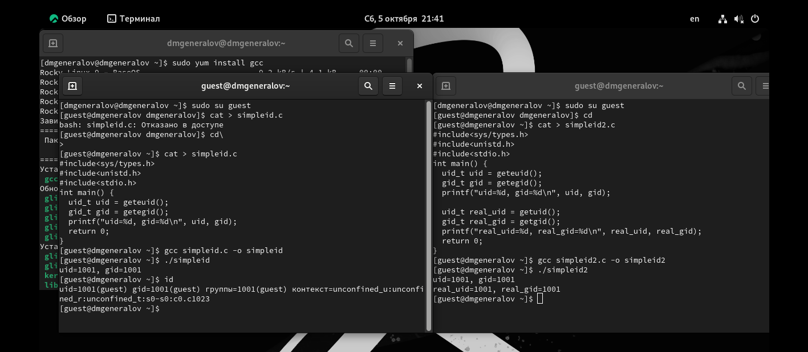
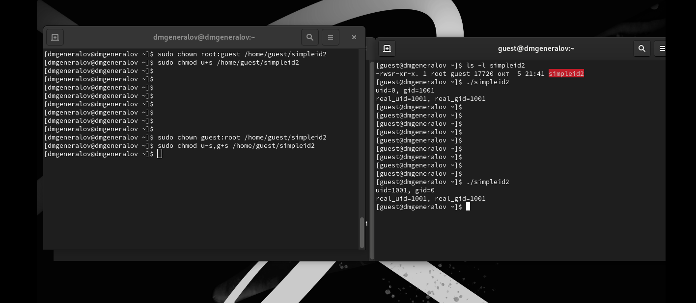
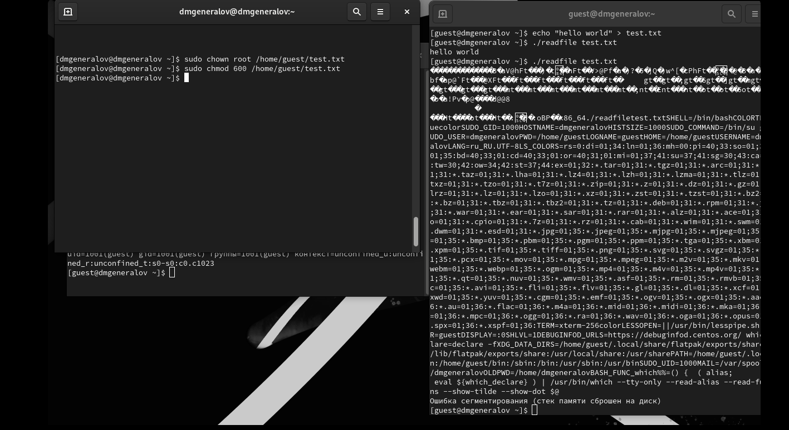
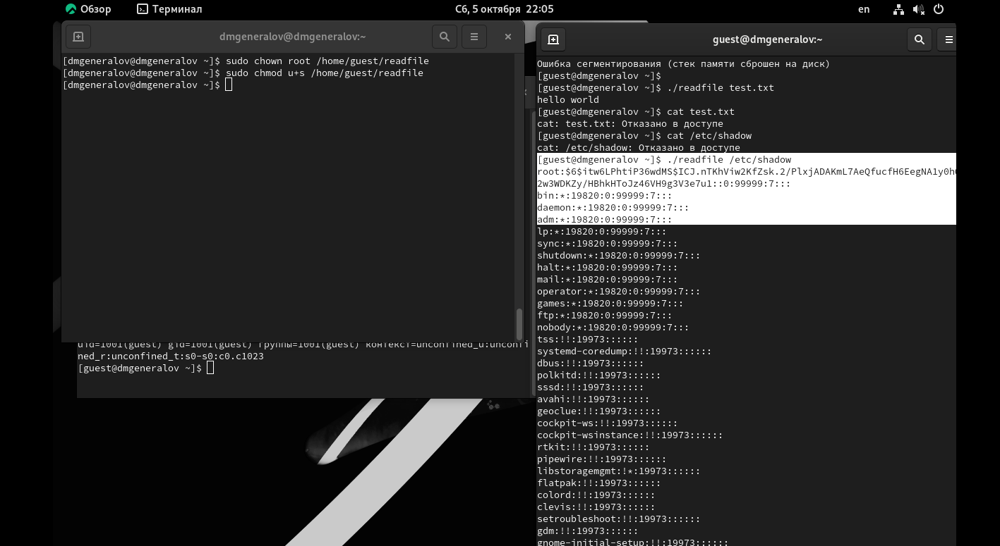
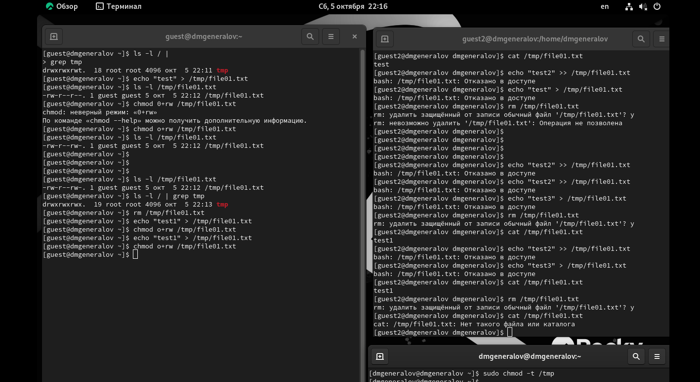

---
## Front matter
lang: ru-RU
title: Лабораторная работа 5
author:
  - Генералов Даниил, 1032212280
institute:
  - Российский университет дружбы народов, Москва, Россия
date: 2024 г.

## i18n babel
babel-lang: russian
babel-otherlangs: english

## Formatting pdf
toc: false
toc-title: Содержание
slide_level: 2
aspectratio: 169
section-titles: true
theme: metropolis
header-includes:
 - \metroset{progressbar=frametitle,sectionpage=progressbar,numbering=fraction}
---

# Задание

Изучение механизмов изменения идентификаторов, применения
SetUID- и Sticky-битов. Получение практических навыков работы в кон-
соли с дополнительными атрибутами. Рассмотрение работы механизма
смены идентификатора процессов пользователей, а также влияние бита
Sticky на запись и удаление файлов.

# Выполнение

## id
{#fig:001 width=70%}

## simpleid2
{#fig:002 width=70%}

## readfile
{#fig:003 width=70%}

## setuid
{#fig:004 width=70%}

## sticky
{#fig:005 width=70%}

# Выводы

В этой лабораторной работе мы использовали механизмы sticky, setuid и setgid-битов,
чтобы посмотреть на некоторые продвинутые механизмы работы с разрешениями файлов в Linux.