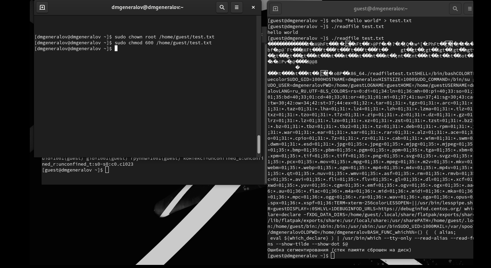
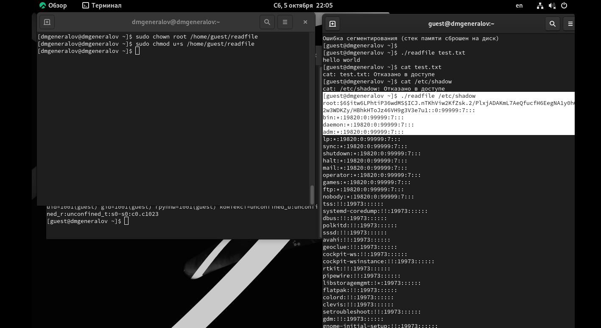

---
## Front matter
title: "Отчет по лабораторной работе 5"
author: "Даниил Генералов, 1032212280"

## Generic otions
lang: ru-RU
toc-title: "Содержание"

## Bibliography
bibliography: bib/cite.bib
csl: pandoc/csl/gost-r-7-0-5-2008-numeric.csl

## Pdf output format
toc: true # Table of contents
toc-depth: 2
lof: true # List of figures
lot: true # List of tables
fontsize: 12pt
linestretch: 1.5
papersize: a4
documentclass: scrreprt
## I18n polyglossia
polyglossia-lang:
  name: russian
  options:
  - spelling=modern
  - babelshorthands=true
polyglossia-otherlangs:
  name: english
## I18n babel
babel-lang: russian
babel-otherlangs: english
## Fonts
mainfont: IBM Plex Serif
romanfont: IBM Plex Serif
sansfont: IBM Plex Sans
monofont: IBM Plex Mono
mathfont: STIX Two Math
mainfontoptions: Ligatures=Common,Ligatures=TeX,Scale=0.94
romanfontoptions: Ligatures=Common,Ligatures=TeX,Scale=0.94
sansfontoptions: Ligatures=Common,Ligatures=TeX,Scale=MatchLowercase,Scale=0.94
monofontoptions: Scale=MatchLowercase,Scale=0.94,FakeStretch=0.9
mathfontoptions:
## Biblatex
biblatex: true
biblio-style: "gost-numeric"
biblatexoptions:
  - parentracker=true
  - backend=biber
  - hyperref=auto
  - language=auto
  - autolang=other*
  - citestyle=gost-numeric
## Pandoc-crossref LaTeX customization
figureTitle: "Рис."
tableTitle: "Таблица"
listingTitle: "Листинг"
lofTitle: "Список иллюстраций"
lotTitle: "Список таблиц"
lolTitle: "Листинги"
## Misc options
indent: true
header-includes:
  - \usepackage{indentfirst}
  - \usepackage{float} # keep figures where there are in the text
  - \floatplacement{figure}{H} # keep figures where there are in the text
---

# Цель работы
Изучение механизмов изменения идентификаторов, применения
SetUID- и Sticky-битов. Получение практических навыков работы в кон-
соли с дополнительными атрибутами. Рассмотрение работы механизма
смены идентификатора процессов пользователей, а также влияние бита
Sticky на запись и удаление файлов.

# Выполнение лабораторной работы

Сначала требуется установить компилятор gcc с помощью `yum install`,
а также временно выключить SELinux:
это нужно, чтобы мы могли скомпилировать программу и затем сделать так, чтобы она запускалась с атрибутом `setuid`.
После того, как мы установили их, мы компилируем и запускаем две программы:
`simpleid` и `simpleid2`:
они выводят идентификаторы пользователя и группы, под которыми запущены.
Эти числа совпадают с выводом команды `id`, что можно увидеть на рис. [@fig:001].

{#fig:001 width=70%}

После этого мы меняем исполняемый файл `simpleid2`:
у него теперь будет владелец `root:guest` и для пользователя будет поставлен setuid-бит.
Теперь в выводе программы будет видно, что настоящий id пользователя сохранился как `1001`,
но эффективный id -- 0 (`root`) благодаря setuid-биту;
аналогично, если файл имеет setgid-бит для группы,
и группа этого файла равна `root`,
то эффективный id группы будет равен `0` (см. рис. [@fig:002]).

{#fig:002 width=70%}

После этого мы компилируем новую программу, которая называется `readfile`:
эта программа принимает на вход название файла и пытается прочитать его.
Сначала мы пытаемся с помощью этой программы прочитать файл, который доступен пользователю `guest`, и это удается.
После этого мы делаем этот файл недоступным для пользователя `guest`,
и программа ломается, потому что она получает ошибку при открытии файла,
и вместо этого начинает читать оперативную память рядом с переменной `buffer`, в итоге выходя за границы разрешенного сегмента памяти и умирая
(рис. [@fig:003]).

{#fig:003 width=70%}

Но после этого мы добавляем `setuid`-бит для этой программы, и теперь мы можем прочитать файлы, которые закрыты от нас,
как можно увидеть на рис. [@fig:004].

{#fig:004 width=70%}

Это связано с тем, что когда setuid-бит задан,
то программа запускается не с правами того пользователя, который ее запустил, а с правами владельца этой программы.
Поскольку в данном случае владельцем является `root`, который имеет права на доступ ко всем файлам в системе,
то программа может прочитать файлы, которые закрыты от нас.

Теперь мы проверяем поведение sticky-бита. Для этого мы создаем файл в папке `/tmp` (которая по умолчанию имеет этот sticky-бит) от имени пользователя `guest`.
После этого мы даем доступ к этому файлу от группы "все остальные",
и после этого используем пользователя `guest2`, чтобы добавить текст к этому файлу, а затем попробовать его перезаписать.
Обе этих вещи не получаются.
После этого мы пробуем прочитать файл (что получается), а затем удалить его (что не получается благодаря sticky-биту).
Затем мы снимаем sticky-бит с папки `/tmp` и создаем файл заново:
как результат, хотя мы все еще не можем изменить содержимое этого файла от имени пользователя `guest2`,
он все-таки может удалить этот файл.
Это можно увидеть на рис. [@fig:005].

{#fig:005 width=70%}

Смысл sticky-бита заключается в том, чтобы файлы в папке принадлежали ее владельцам,
и другие пользователи -- даже те, кто имеет доступ к этой папке -- не могли удалять их.
Это очень нужно для `/tmp` и других общих директорий,
потому что тогда один пользователь не может удалить файлы другого пользователя.

# Выводы

В этой лабораторной работе мы использовали механизмы sticky, setuid и setgid-битов,
чтобы посмотреть на некоторые продвинутые механизмы работы с разрешениями файлов в Linux.