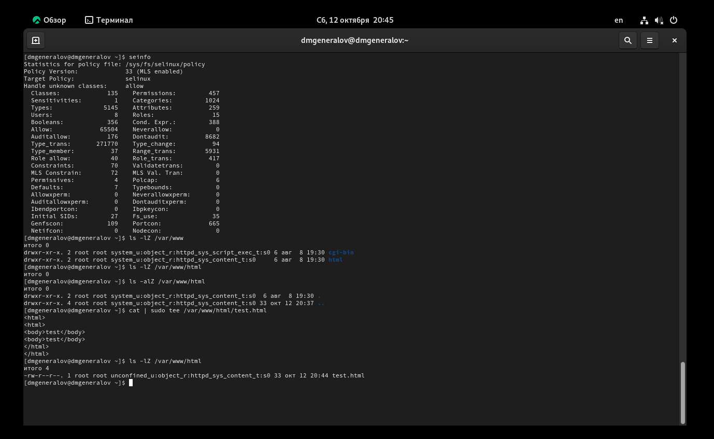

---
## Front matter
lang: ru-RU
title: Лабораторная работа 6
author:
  - Генералов Даниил, 1032212280
institute:
  - Российский университет дружбы народов, Москва, Россия
date: 2024 г.

## i18n babel
babel-lang: russian
babel-otherlangs: english

## Formatting pdf
toc: false
toc-title: Содержание
slide_level: 2
aspectratio: 169
section-titles: true
theme: metropolis
header-includes:
 - \metroset{progressbar=frametitle,sectionpage=progressbar,numbering=fraction}
---

# Задание

Развить навыки администрирования ОС Linux. Получить первое прак-
тическое знакомство с технологией SELinux.
Проверить работу SELinx на практике совместно с веб-сервером
Apache.

# Выполнение

## SELinux
{#fig:001 width=70%}

## SELinux
{#fig:002 width=70%}

## SELinux
{#fig:003 width=70%}

## SELinux
{#fig:004 width=70%}

# Выводы

В этой лабораторной работе мы рассмотрели, как использовать SELinux
для ограничения возможностей процессов, на примере Apache.