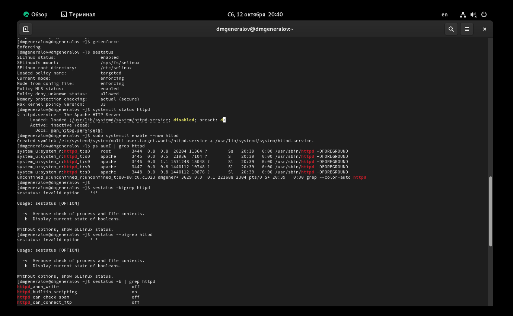
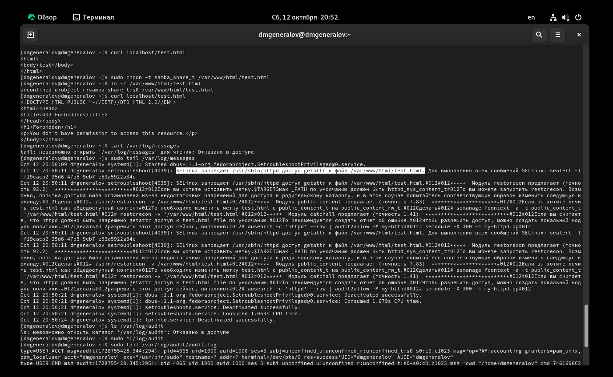
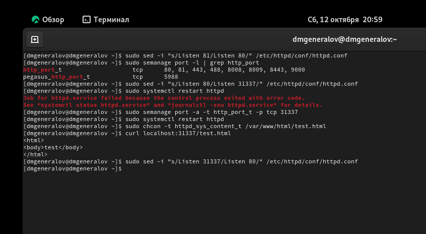

---
## Front matter
title: "Отчет по лабораторной работе 6"
author: "Даниил Генералов, 1032212280"

## Generic otions
lang: ru-RU
toc-title: "Содержание"

## Bibliography
bibliography: bib/cite.bib
csl: pandoc/csl/gost-r-7-0-5-2008-numeric.csl

## Pdf output format
toc: true # Table of contents
toc-depth: 2
lof: true # List of figures
lot: true # List of tables
fontsize: 12pt
linestretch: 1.5
papersize: a4
documentclass: scrreprt
## I18n polyglossia
polyglossia-lang:
  name: russian
  options:
  - spelling=modern
  - babelshorthands=true
polyglossia-otherlangs:
  name: english
## I18n babel
babel-lang: russian
babel-otherlangs: english
## Fonts
mainfont: IBM Plex Serif
romanfont: IBM Plex Serif
sansfont: IBM Plex Sans
monofont: IBM Plex Mono
mathfont: STIX Two Math
mainfontoptions: Ligatures=Common,Ligatures=TeX,Scale=0.94
romanfontoptions: Ligatures=Common,Ligatures=TeX,Scale=0.94
sansfontoptions: Ligatures=Common,Ligatures=TeX,Scale=MatchLowercase,Scale=0.94
monofontoptions: Scale=MatchLowercase,Scale=0.94,FakeStretch=0.9
mathfontoptions:
## Biblatex
biblatex: true
biblio-style: "gost-numeric"
biblatexoptions:
  - parentracker=true
  - backend=biber
  - hyperref=auto
  - language=auto
  - autolang=other*
  - citestyle=gost-numeric
## Pandoc-crossref LaTeX customization
figureTitle: "Рис."
tableTitle: "Таблица"
listingTitle: "Листинг"
lofTitle: "Список иллюстраций"
lotTitle: "Список таблиц"
lolTitle: "Листинги"
## Misc options
indent: true
header-includes:
  - \usepackage{indentfirst}
  - \usepackage{float} # keep figures where there are in the text
  - \floatplacement{figure}{H} # keep figures where there are in the text
---

# Цель работы

Развить навыки администрирования ОС Linux. Получить первое прак-
тическое знакомство с технологией SELinux.
Проверить работу SELinx на практике совместно с веб-сервером
Apache.

# Выполнение лабораторной работы

Сначала нужно установить в нашу лабораторную виртуальную машину Apache
и отключить пакетный фильтр.
После этого мы проверяем, что SELinux работает в режиме enforcing targeted,
что Apache запущен (и исправляем это),
а также что Apache запущен под своим собственным контекстом `httpd_t`,
и что есть много SELinux-boolean про httpd [@fig:001].

{#fig:001 width=70%}

После этого мы видим, что есть 135 классов и 5145 типов в SELinux.
Затем мы видим, что в папке /var/www/html и дочерних папках контекст `system_u:object_r:httpd_sys_content_t`,
а в /var/www/cgi-bin `system_u:object_r:httpd_sys_script_exec_t`.
Если суперпользователь создаст файл в /var/www/html, то ему будет выдан контекст `unconfined_u:object_r:httpd_sys_content_t`:
теперь httpd имеет к нему доступ (рис. [@fig:002]).

{#fig:002 width=70%}

Теперь можно проверить, что сервер имеет к нему доступ,
попробовав скачать этот файл с него.
После этого мы меняем контекст этого файла,
и теперь сервер не имеет к нему доступаю
SeTroubleshoot подсказывает, что ошибка доступа произошла именно из-за
SELinux,
и предлагает, как ее можно исправить (рис. [@fig:003]).

{#fig:003 width=70%}

Если мы настроим, чтобы Apache пытался слушать порт 81, а не порт 80,
то он смог запуститься, потому что оказывается в настройках по умолчанию
порт 81 уже разрешен для типа http_port_t.
Чтобы продемонстрировать ситуацию, когда это не разрешено,
я вместо этого выбрал порт 31337:
теперь запуск httpd блокируется.
Чтобы это было разрешено, нужно добавить этот порт в список разрешенных
для типа http_port_t:
после этого запуск будет успешен,
и, вернув исходный контекст файлу,
можно будет скачать его (рис. [@fig:004]).

{#fig:004 width=70%}

# Выводы

В этой лабораторной работе мы рассмотрели, как использовать SELinux
для ограничения возможностей процессов, на примере Apache.