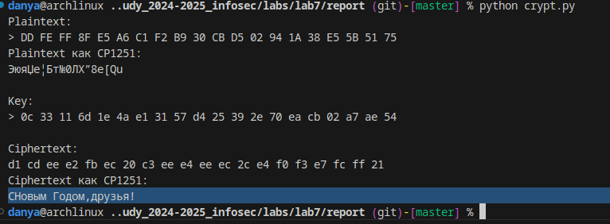

---
## Front matter
title: "Отчет по лабораторной работе 7"
author: "Даниил Генералов, 1032212280"

## Generic otions
lang: ru-RU
toc-title: "Содержание"

## Bibliography
bibliography: bib/cite.bib
csl: pandoc/csl/gost-r-7-0-5-2008-numeric.csl

## Pdf output format
toc: true # Table of contents
toc-depth: 2
lof: true # List of figures
lot: true # List of tables
fontsize: 12pt
linestretch: 1.5
papersize: a4
documentclass: scrreprt
## I18n polyglossia
polyglossia-lang:
  name: russian
  options:
  - spelling=modern
  - babelshorthands=true
polyglossia-otherlangs:
  name: english
## I18n babel
babel-lang: russian
babel-otherlangs: english
## Fonts
mainfont: IBM Plex Serif
romanfont: IBM Plex Serif
sansfont: IBM Plex Sans
monofont: IBM Plex Mono
mathfont: STIX Two Math
mainfontoptions: Ligatures=Common,Ligatures=TeX,Scale=0.94
romanfontoptions: Ligatures=Common,Ligatures=TeX,Scale=0.94
sansfontoptions: Ligatures=Common,Ligatures=TeX,Scale=MatchLowercase,Scale=0.94
monofontoptions: Scale=MatchLowercase,Scale=0.94,FakeStretch=0.9
mathfontoptions:
## Biblatex
biblatex: true
biblio-style: "gost-numeric"
biblatexoptions:
  - parentracker=true
  - backend=biber
  - hyperref=auto
  - language=auto
  - autolang=other*
  - citestyle=gost-numeric
## Pandoc-crossref LaTeX customization
figureTitle: "Рис."
tableTitle: "Таблица"
listingTitle: "Листинг"
lofTitle: "Список иллюстраций"
lotTitle: "Список таблиц"
lolTitle: "Листинги"
## Misc options
indent: true
header-includes:
  - \usepackage{indentfirst}
  - \usepackage{float} # keep figures where there are in the text
  - \floatplacement{figure}{H} # keep figures where there are in the text
---

# Цель работы

Освоить на практике применение режима однократного гаммирования.

# Выполнение лабораторной работы

Эта лабораторная работа подразумевает разработку программы, которая
использует шифрование с режимом однократного гаммирования:
это подразумевает, что байты сообщения смешиваются с помощью XOR
с байтами ключа.

Если ключ используется только один раз,
то этот способ шифрования называется _one-time pad_.

Это единственный теоретически-безопасный способ шифрования:
если не знать ключа, то, пытаясь подобрать ключ,
можно получить любое сообщение длины, совпадающей с исходной длиной.
Нет никакой возможности определить, какое из сообщений является настоящим.

Этот алгоритм является симметричным алгоритмом шифрования:
тот же самый ключ используется как для того, чтобы получить шифртекст,
так и для того, чтобы из шифртекста получить исходный текст.
Он также является симметричным в более широком смысле:
нет никакой разницы между ключом и шифртекстом.

Благодаря этому свойству мы можем решить задачу в лабораторной работе:
нам дан шифртекст `DD FE FF 8F E5 A6 C1 F2 B9 30 CB D5 02 94 1A 38 E5 5B 51 75`,
который можно сочетать с двумя разными ключами,
чтобы получить разные сообщения: `Штирлиц – Вы Герой!!` и `Штирлиц - Вы Болван!`.
Нам требуется найти ключ, используя который, можно получить `С Новым Годом, друзья!`.

Поскольку все сообщения написаны в кодировке CP1251, нужно, чтобы и это сообщение было написано в ней:
это можно сделать командой на Python, как на рис. [@fig:001].

{#fig:001 width=70%}

Значит, это сообщение имеет байты `d1 20 cd ee e2 fb ec 20 c3 ee e4 ee ec 2c 20 e4 f0 f3 e7 fc ff 21`.
Из-за того, что это сообщение на два байта длинее, чем исходные,
нужно его сократить:
если удалить пробел после буквы `C` и после запятой, то получится
`d1 cd ee e2 fb ec 20 c3 ee e4 ee ec 2c e4 f0 f3 e7 fc ff 21`

После этого мы пишем программу, которая читает два значения:
простой текст и ключ --
и выдает шифртекст.
Из-за симметрии алгоритма,
эта же программа может принять шифртекст и ключ и выдать исходный текст.
Эту программу можно увидеть на рис. [@fig:002].

{#fig:002 width=70%}

Затем можно использовать эту программу, чтобы проверить,
что расшифровка происходит таким образом как мы ожидаем:
на рис. [@fig:003] я передаю туда параметры из примера
и вижу, что результат действительно тот, который должен быть.

{#fig:003 width=70%}

После этого можно попробовать передать как один из параметров шифртекст,
а как другой -- тот текст, который нужно, чтобы получился.

{#fig:004 width=70%}

В результате комбинации этих двух строк мы получаем `0c 33 11 6d 1e 4a e1 31 57 d4 25 39 2e 70 ea cb 02 a7 ae 54` --
строку, которую нужно использовать как ключ.
Наконец, мы комбинируем этот ключ с исходным зашифрованным сообщением,
и на рис. [@fig:005] можно увидеть, что сообщение `СНовым Годом,друзья!`
получилось из исходного шифртекста.
Это доказывает, что один и тот же шифртекст можно интерпретировать как любое сообщение данной длины.

{#fig:005 width=70%}

# Контрольные вопросы
1. Поясните смысл однократного гаммирования.

Однократное гаммирование заключается в комбинации простого текста
и ключа с помощью операции XOR для получения шифртекста,
а затем комбинации этого же ключа и шифртекста для получения исходного текста.

2. Перечислите недостатки однократного гаммирования.

Ключ сообщения должен иметь такую же длину, как и само сообщение,
и он не может быть использован больше одного раза (иначе тривиально определить, какой это ключ, зная два разных шифртекста).
Из-за этого практические использования такого шифра очень ограниченны.

3. Перечислите преимущества однократного гаммирования.

Этот шифр единственный предоставляет абсолютную теоретическую безопасность:
изменяя значение ключа, можно получить из одного и того же шифртекста любой исходный текст,
и нет возможности определить, какой из них правильный.

4. Почему длина открытого текста должна совпадать с длиной ключа?

Шифртекст -- это открытый текст, у которого каждый бит был XOR-ен с каждым битом ключа.
Если битов ключа не хватает, то нужно найти их где-то еще,
но любые способы расширения ключа не имеют теоретической безопасности.
Практические алгоритмы симметричного шифрования фактически используют однократное гаммирование,
но используя ключ, который создан из псевдослучайного генератора:
этот компонент не имеет теоретической безопасности,
и поэтому такая схема не является настоящим однократным гаммированием.

5. Какая операция используется в режиме однократного гаммирования, назовите её особенности?

Операция XOR комбинирует два бита,
возвращая 1, если эти биты были разными, и 0, если они были одинаковыми.
Эта операция обратимая и коммутативная,
из-за чего в алгоритме нет строго различия между шифртекстом,
простым текстом и ключом.

6. Как по открытому тексту и ключу получить шифротекст?

Нужно сделать XOR между этими двумя строками.

7. Как по открытому тексту и шифротексту получить ключ?

Также, нужно сделать XOR между этими двумя строками.
Именно из-за этого нет принципиальной разницы между ключом и шифртекстом.

8. В чем заключаются необходимые и достаточные условия абсолютной стойкости шифра?

Необходимо и достаточно использование уникальных ключей для каждого сообщения,
которые никогда больше не повторяются.
Если сделать не так,
то можно определить биты ключа
по совпадениям между разными шифртекстами.

# Выводы

В этой лабораторной работе мы рассмотрели алгоритм однократного гаммирования
и показали, каким образом можно шифровать и дешифровать сообщения с помощью него.