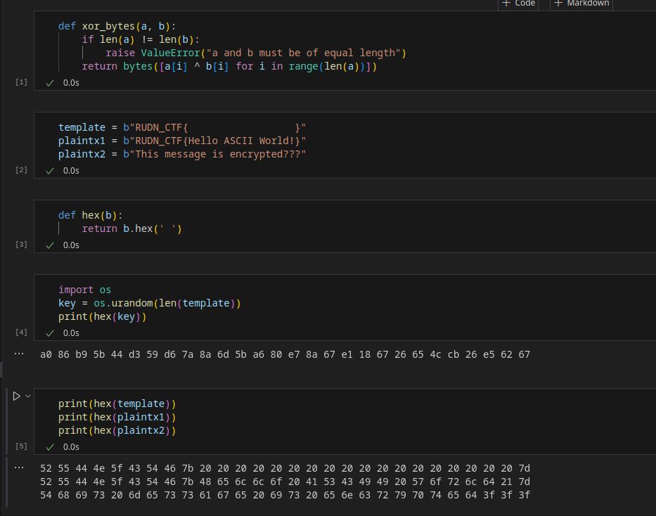
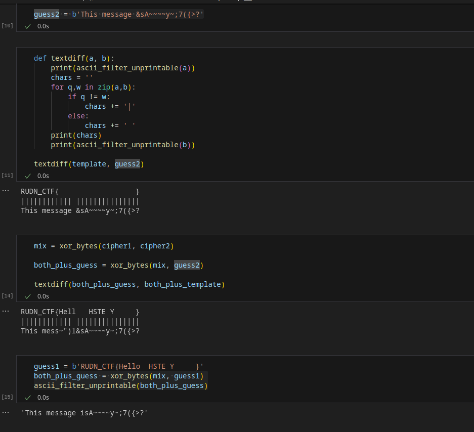
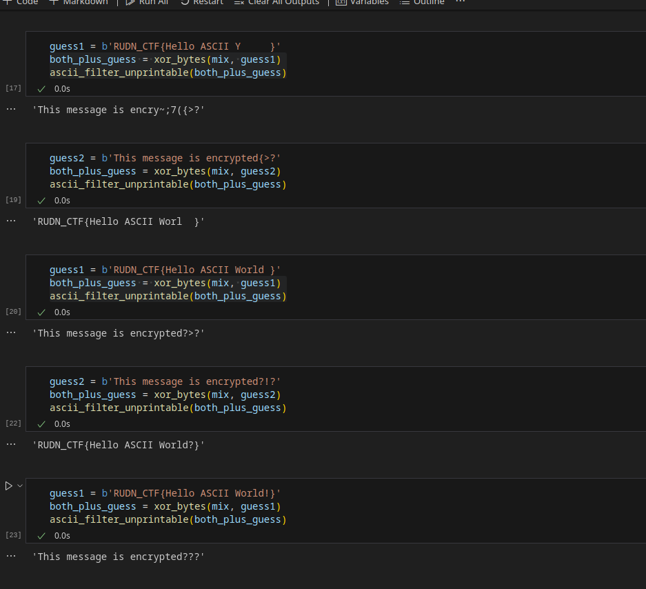

---
## Front matter
lang: ru-RU
title: Лабораторная работа 8
author:
  - Генералов Даниил, 1032212280
institute:
  - Российский университет дружбы народов, Москва, Россия
date: 2024 г.

## i18n babel
babel-lang: russian
babel-otherlangs: english

## Formatting pdf
toc: false
toc-title: Содержание
slide_level: 2
aspectratio: 169
section-titles: true
theme: metropolis
header-includes:
 - \metroset{progressbar=frametitle,sectionpage=progressbar,numbering=fraction}
---

# Задание

Освоить на практике применение режима однократного гаммирования
на примере кодирования различных исходных текстов одним ключом.

# Выполнение

## Python
{#fig:001 width=70%}

## Python
{#fig:002 width=70%}

## Python
{#fig:003 width=70%}

## Python
{#fig:004 width=70%}

# Выводы

В этой лабораторной работе мы рассмотрели алгоритм однократного гаммирования
и показали его слабость в случае, когда один и тот же ключ используется больше одного раза.