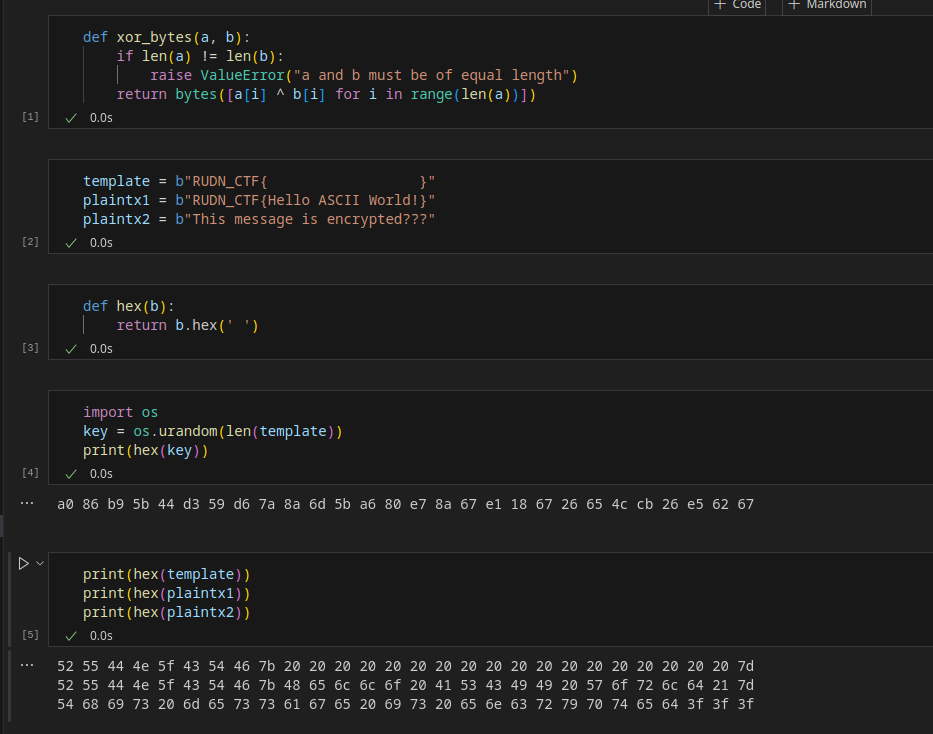
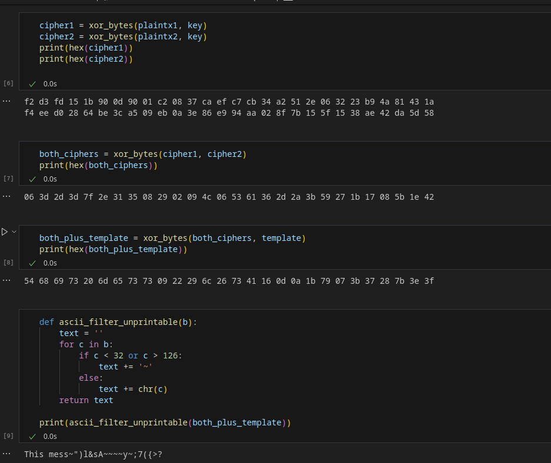
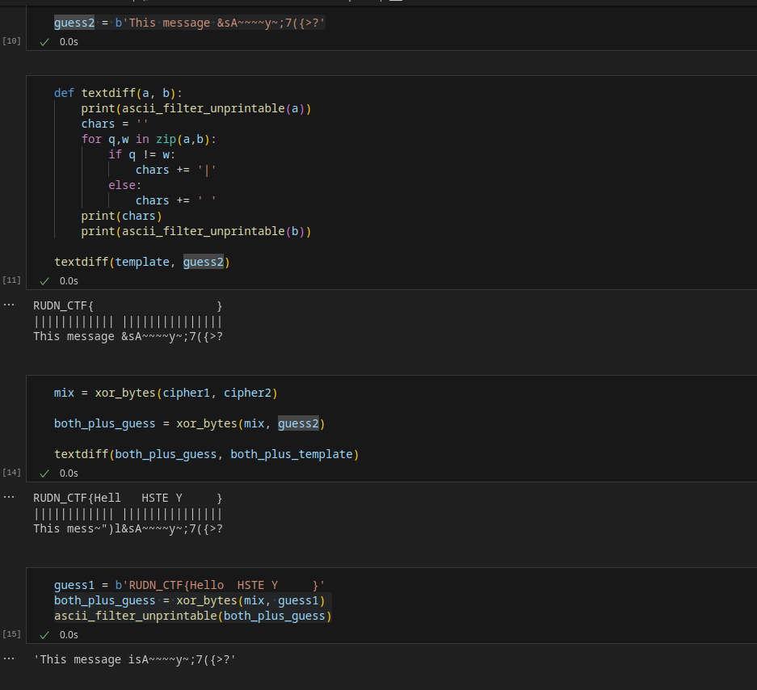

---
## Front matter
title: "Отчет по лабораторной работе 8"
author: "Даниил Генералов, 1032212280"

## Generic otions
lang: ru-RU
toc-title: "Содержание"

## Bibliography
bibliography: bib/cite.bib
csl: pandoc/csl/gost-r-7-0-5-2008-numeric.csl

## Pdf output format
toc: true # Table of contents
toc-depth: 2
lof: true # List of figures
lot: true # List of tables
fontsize: 12pt
linestretch: 1.5
papersize: a4
documentclass: scrreprt
## I18n polyglossia
polyglossia-lang:
  name: russian
  options:
  - spelling=modern
  - babelshorthands=true
polyglossia-otherlangs:
  name: english
## I18n babel
babel-lang: russian
babel-otherlangs: english
## Fonts
mainfont: IBM Plex Serif
romanfont: IBM Plex Serif
sansfont: IBM Plex Sans
monofont: IBM Plex Mono
mathfont: STIX Two Math
mainfontoptions: Ligatures=Common,Ligatures=TeX,Scale=0.94
romanfontoptions: Ligatures=Common,Ligatures=TeX,Scale=0.94
sansfontoptions: Ligatures=Common,Ligatures=TeX,Scale=MatchLowercase,Scale=0.94
monofontoptions: Scale=MatchLowercase,Scale=0.94,FakeStretch=0.9
mathfontoptions:
## Biblatex
biblatex: true
biblio-style: "gost-numeric"
biblatexoptions:
  - parentracker=true
  - backend=biber
  - hyperref=auto
  - language=auto
  - autolang=other*
  - citestyle=gost-numeric
## Pandoc-crossref LaTeX customization
figureTitle: "Рис."
tableTitle: "Таблица"
listingTitle: "Листинг"
lofTitle: "Список иллюстраций"
lotTitle: "Список таблиц"
lolTitle: "Листинги"
## Misc options
indent: true
header-includes:
  - \usepackage{indentfirst}
  - \usepackage{float} # keep figures where there are in the text
  - \floatplacement{figure}{H} # keep figures where there are in the text
---

# Цель работы

Освоить на практике применение режима однократного гаммирования
на примере кодирования различных исходных текстов одним ключом.

# Выполнение лабораторной работы

Сначала нам потребуется программа, которая позволяет сделать XOR-шифрование между двумя байтовами строками,
а также шаблон, который позволяет нам определить общие компоненты между двумя сообщениями.
Это -- те шаги, которые предпринимает пользователь криптосистемы:
та информация, которая ему доступна, видна на [@fig:001].

{#fig:001 width=70%}

После этого злоумышленник получает доступ к двум шифртекстам и исходному тексту шаблона.
Сделав XOR между двумя шифртекстами, мы получаем нули там,
где эти два шифртекста совпадают --
это либо те байты, которые являются частью шаблона,
либо те, которые повторяются между двумя шифртекстами.
Затем, сделав XOR между этим и шаблоном, можно найти те слова,
которые могут быть частью исходного текста (рис. [@fig:002]).

{#fig:002 width=70%}

Можно затем попробовать этот процесс несколько раз, чтобы отгадывать больше частей исходного сообщения:
подставлять угаданные куски, затем делать XOR, и смотреть какие части остаются.

{#fig:003 width=70%}

Постепенно, смешивая шифртекст со своим предсказанием,
мы можем получить исходные тексты обоих сообщений на рис. [@fig:004].
Зная исходные тексты и шифртексты, мы можем определить ключ,
и затем разшифровывать любые другие сообщения,
которые зашифрованы этим ключом (а также генерировать собственные).

{#fig:004 width=70%}

# Контрольные вопросы
1. Как, зная один из текстов (P1 или P2), определить другой, не зная при этом ключа?

Если известен один шифртекст и его связанный исходный текст,
то можно сделать XOR между ними, чтобы определить ключ.
После этого можно использовать этот ключ,
чтобы разшифровать другой шифртекст.

2. Что будет при повторном использовании ключа при шифровании текста?

Злоумышленник, наблюдающий оба шифртекста, может определить части исходного текста этих сообщений.

3. Как реализуется режим шифрования однократного гаммирования одним ключом двух открытых текстов?

После обычного шифрования используемый ключ не выбрасывается,
а используется для шифрования второго текста.

4. Перечислите недостатки шифрования одним ключом двух открытых текстов.

Как мы показали в этой лабораторной работе, самым большим недостатком этой схемы является то, что
злоумышленник, наблюдающий оба шифртекста,
может определить исходный текст сообщений.

5. Перечислите преимущества шифрования одним ключом двух открытых текстов.

Для этого шифрования можно использовать один и тот же ключ. Поскольку в режиме однократного гаммирования
длина ключа равна длине сообщения,
то использование одного и того же ключа позволяет минимизировать количество общих данных.

# Выводы

В этой лабораторной работе мы рассмотрели алгоритм однократного гаммирования
и показали его слабость в случае, когда один и тот же ключ используется больше одного раза.