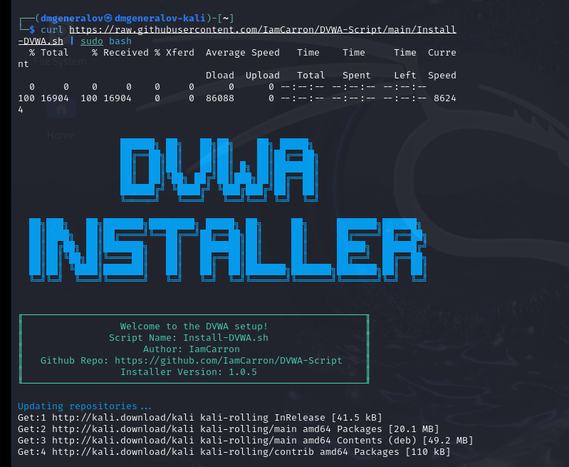
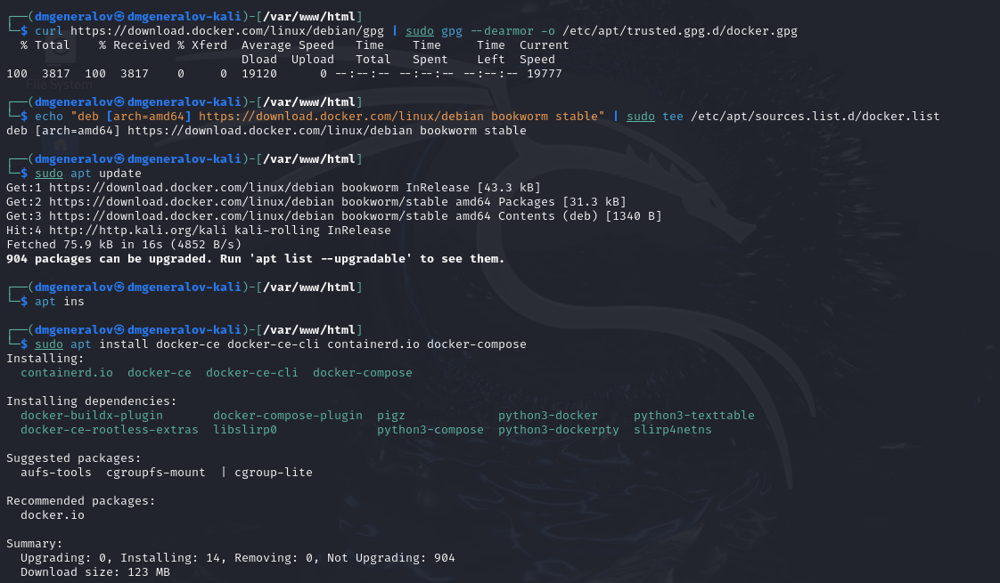
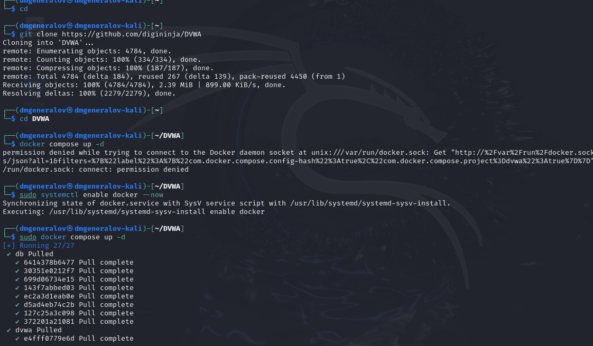
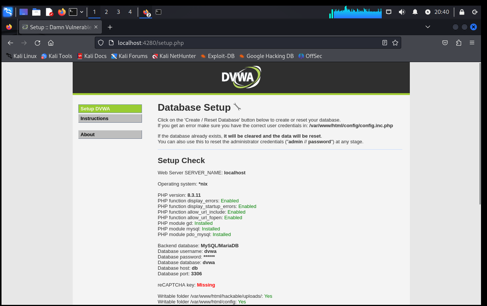
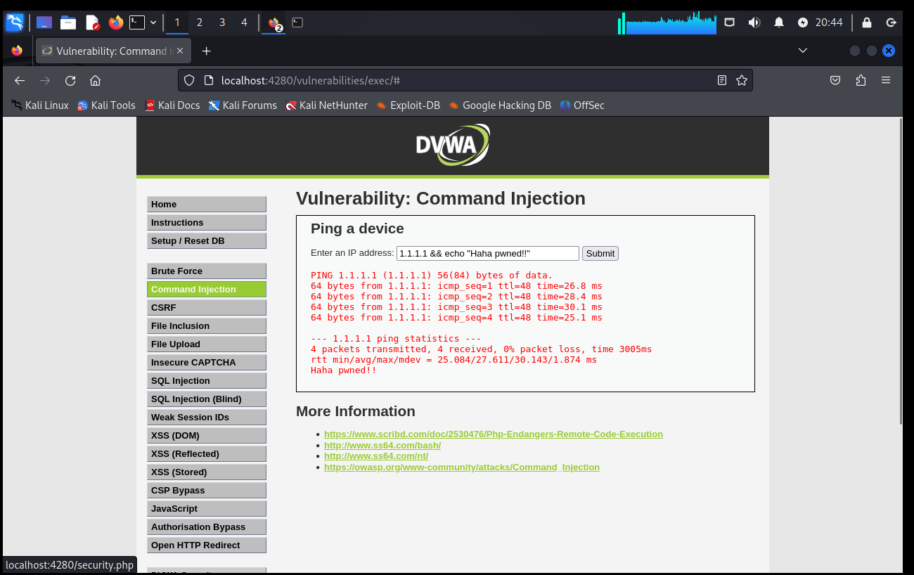

---
## Front matter
lang: ru-RU
title: Индивидуальный проект шаг 2
author:
  - Генералов Даниил, 1032212280
institute:
  - Российский университет дружбы народов, Москва, Россия
date: 2024 г.

## i18n babel
babel-lang: russian
babel-otherlangs: english

## Formatting pdf
toc: false
toc-title: Содержание
slide_level: 2
aspectratio: 169
section-titles: true
theme: metropolis
header-includes:
 - \metroset{progressbar=frametitle,sectionpage=progressbar,numbering=fraction}
---

# Задание

В этом этапе индивидуального проекта требуется установить Damn Vulnerable Web Application (DVWA) на виртуальную машину,
которую мы установили в предыдущем этапе.

# Выполнение

## DVWA-Install.sh

{#fig:001 width=70%}

# Docker

{#fig:002 width=70%}

# Docker Compose

{#fig:003 width=70%}

# DVWA

{#fig:004 width=70%}

# DVWA

{#fig:005 width=70%}

# Выводы

Мы успешно установили DVWA и попробовали эксплуатировать одну из уязвимостей. Это доказывает, что установка была осуществлена успешно.
