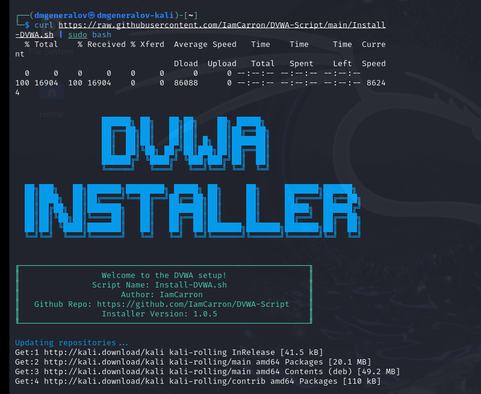
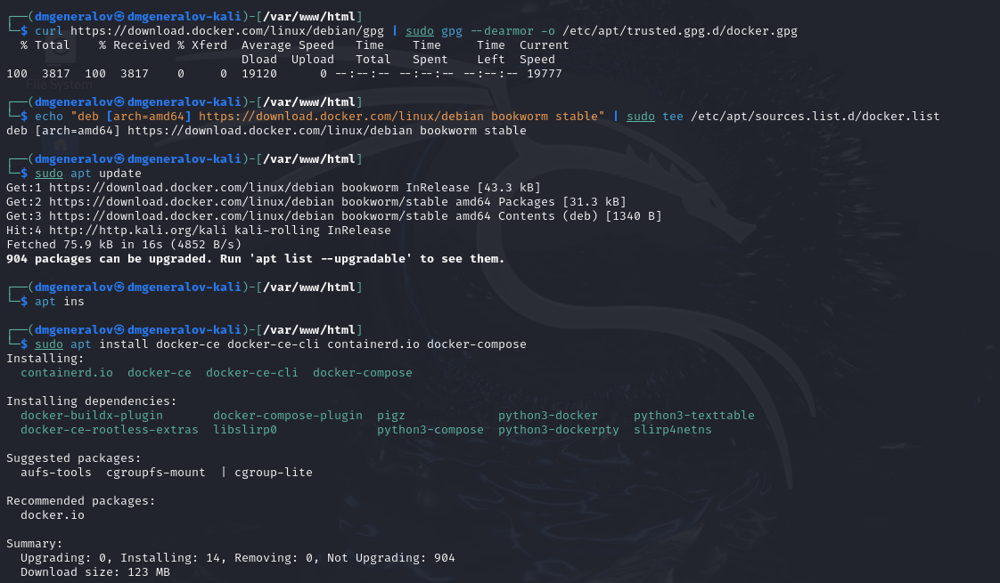
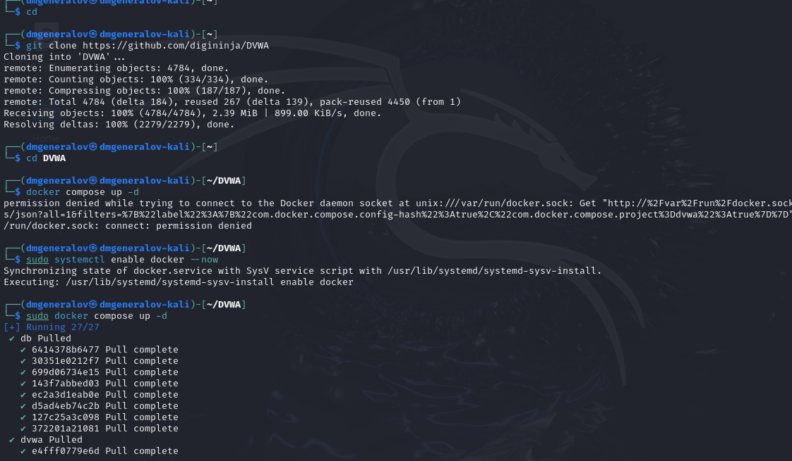
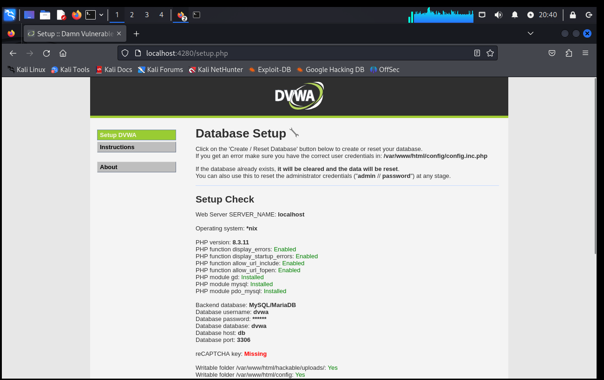

---
## Front matter
title: "Индивидуальный проект 2"
author: "Генералов Даниил, 1032212280"

## Generic otions
lang: ru-RU
toc-title: "Содержание"

## Bibliography
bibliography: bib/cite.bib
csl: pandoc/csl/gost-r-7-0-5-2008-numeric.csl

## Pdf output format
toc: true # Table of contents
toc-depth: 2
lof: true # List of figures
lot: true # List of tables
fontsize: 12pt
linestretch: 1.5
papersize: a4
documentclass: scrreprt
## I18n polyglossia
polyglossia-lang:
  name: russian
  options:
  - spelling=modern
  - babelshorthands=true
polyglossia-otherlangs:
  name: english
## I18n babel
babel-lang: russian
babel-otherlangs: english
## Fonts
mainfont: IBM Plex Serif
romanfont: IBM Plex Serif
sansfont: IBM Plex Sans
monofont: IBM Plex Mono
mathfont: STIX Two Math
mainfontoptions: Ligatures=Common,Ligatures=TeX,Scale=0.94
romanfontoptions: Ligatures=Common,Ligatures=TeX,Scale=0.94
sansfontoptions: Ligatures=Common,Ligatures=TeX,Scale=MatchLowercase,Scale=0.94
monofontoptions: Scale=MatchLowercase,Scale=0.94,FakeStretch=0.9
mathfontoptions:
## Biblatex
biblatex: true
biblio-style: "gost-numeric"
biblatexoptions:
  - parentracker=true
  - backend=biber
  - hyperref=auto
  - language=auto
  - autolang=other*
  - citestyle=gost-numeric
## Pandoc-crossref LaTeX customization
figureTitle: "Рис."
tableTitle: "Таблица"
listingTitle: "Листинг"
lofTitle: "Список иллюстраций"
lotTitle: "Список таблиц"
lolTitle: "Листинги"
## Misc options
indent: true
header-includes:
  - \usepackage{indentfirst}
  - \usepackage{float} # keep figures where there are in the text
  - \floatplacement{figure}{H} # keep figures where there are in the text
---

# Цель работы

В этом этапе индивидуального проекта требуется установить Damn Vulnerable Web Application (DVWA) на виртуальную машину,
которую мы установили в предыдущем этапе.

# Выполнение лабораторной работы

Самый простой из официальных способов установки DVWA -- с помощью скрипта, который устанавливает необходимые компоненты
на любой Debian-совместимой ОС, в том числе Kali Linux (рис. [-@fig:001]).

{#fig:001 width=70%}

К сожалению, этот скрипт имеет некоторые проблемы с развертыванием базы данных.
Поэтому вместо этого можно попробовать использовать установку с помощью Docker и Docker Compose.
Для этого нужно сначала установить их (рис. [-@fig:002]).

{#fig:002 width=70%}

После этого мы скачиваем репозиторий DVWA -- в основном ради Docker Compose-файла -- и запускаем его (рис. [-@fig:003]).

{#fig:003 width=70%}

Теперь веб-приложение работает и приглашает выполнить начальную настройку базы данных (рис. [-@fig:004]).

{#fig:004 width=70%}

После этого можно зайти в веб-интерфейс и экспериментировать с различными уязвимостями (рис. [-@fig:005]).

{#fig:005 width=70%}

# Выводы

Мы успешно установили DVWA и попробовали эксплуатировать одну из уязвимостей. Это доказывает, что установка была осуществлена успешно.
