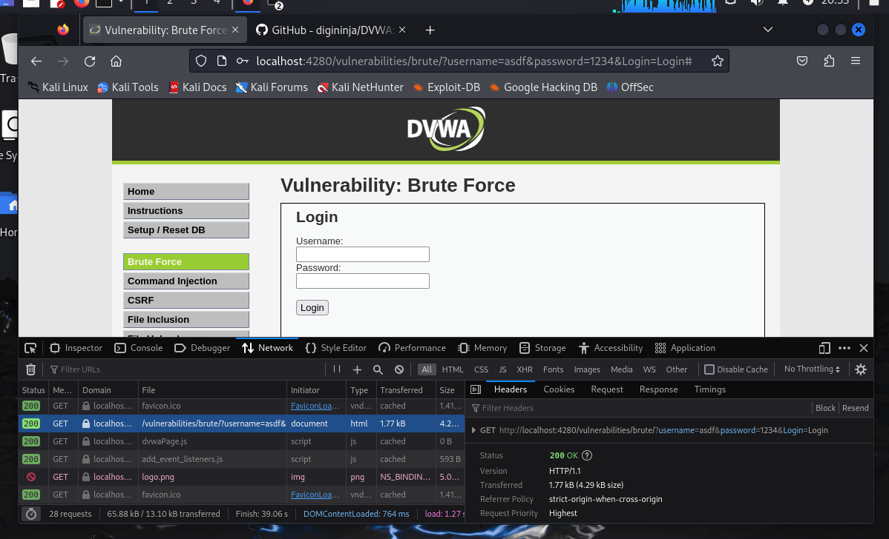
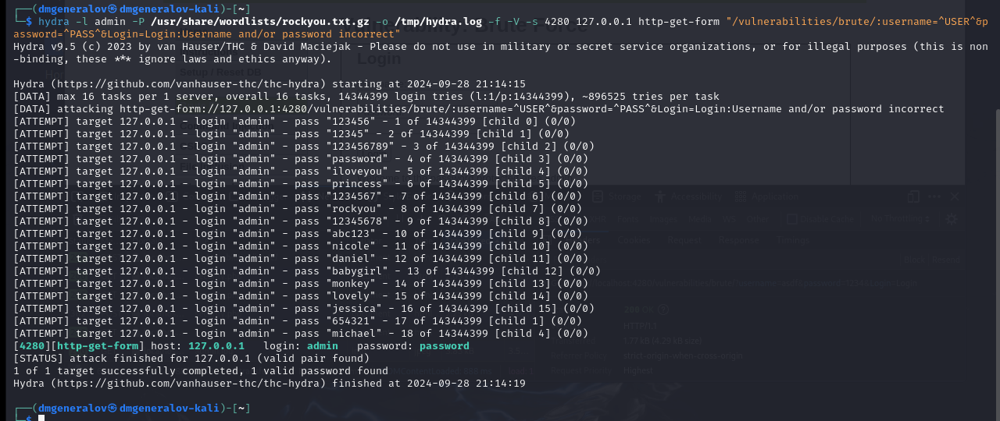
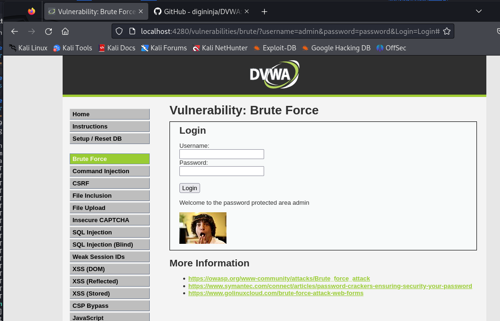

---
## Front matter
title: "Индивидуальный проект 3"
author: "Генералов Даниил, 1032212280"

## Generic otions
lang: ru-RU
toc-title: "Содержание"

## Bibliography
bibliography: bib/cite.bib
csl: pandoc/csl/gost-r-7-0-5-2008-numeric.csl

## Pdf output format
toc: true # Table of contents
toc-depth: 2
lof: true # List of figures
lot: true # List of tables
fontsize: 12pt
linestretch: 1.5
papersize: a4
documentclass: scrreprt
## I18n polyglossia
polyglossia-lang:
  name: russian
  options:
  - spelling=modern
  - babelshorthands=true
polyglossia-otherlangs:
  name: english
## I18n babel
babel-lang: russian
babel-otherlangs: english
## Fonts
mainfont: IBM Plex Serif
romanfont: IBM Plex Serif
sansfont: IBM Plex Sans
monofont: IBM Plex Mono
mathfont: STIX Two Math
mainfontoptions: Ligatures=Common,Ligatures=TeX,Scale=0.94
romanfontoptions: Ligatures=Common,Ligatures=TeX,Scale=0.94
sansfontoptions: Ligatures=Common,Ligatures=TeX,Scale=MatchLowercase,Scale=0.94
monofontoptions: Scale=MatchLowercase,Scale=0.94,FakeStretch=0.9
mathfontoptions:
## Biblatex
biblatex: true
biblio-style: "gost-numeric"
biblatexoptions:
  - parentracker=true
  - backend=biber
  - hyperref=auto
  - language=auto
  - autolang=other*
  - citestyle=gost-numeric
## Pandoc-crossref LaTeX customization
figureTitle: "Рис."
tableTitle: "Таблица"
listingTitle: "Листинг"
lofTitle: "Список иллюстраций"
lotTitle: "Список таблиц"
lolTitle: "Листинги"
## Misc options
indent: true
header-includes:
  - \usepackage{indentfirst}
  - \usepackage{float} # keep figures where there are in the text
  - \floatplacement{figure}{H} # keep figures where there are in the text
---

# Цель работы

В этом этапе индивидуального проекта требуется использовать Hydra -- приложение для взлома паролей --
для получения доступа к серверу DVWA.

# Выполнение лабораторной работы

Hydra требует указания цели, а также метода, которым мы будем пробовать логин-пароль.
Чтобы определить метод, мы должны сначала сделать свой запрос к веб-сервису,
чтобы определить, каким образом эти данные передаются на сервер.
Как видно из рис. [-@fig:001], этот метод -- это GET-запрос с аргументами в адресе.

{#fig:001 width=70%}

После этого мы формируем команду Hydra, чтобы получить доступ, на основании информации, которую мы получили в предыдущем этапе.
Эта команда имеет вид:

```bash
hydra -l admin -P /usr/share/wordlists/rockyou.txt.gz -o /tmp/hydra.log -f -V -s 4280 127.0.0.1 http-get-form "/vulnerabilities/brute/:username=^USER^&password=^PASS^^&Login=Login:?Username and/or password incorrect"
```

Как видно на рис. [-@fig:002], мы быстро находим, что пароль для этого пользователя -- `password`.

{#fig:002 width=70%}

Наконец, мы пробуем использовать этот пароль в веб-интерфейсе и получаем доступ к защищенной картинке на рис. [-@fig:003].

{#fig:003 width=70%}


# Выводы

Мы успешно использовали Hydra, чтобы эксплуатировать уязвимость, связанную с низким уровнем защиты от bruteforce и простым паролем.
