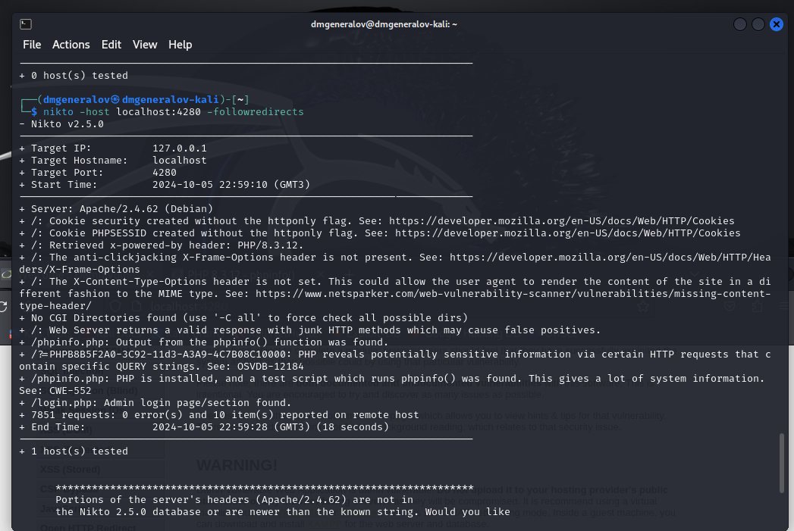
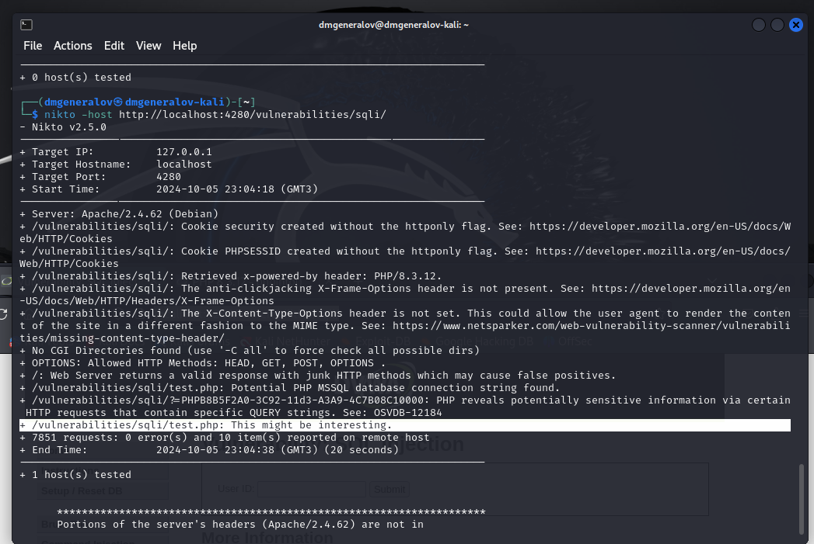
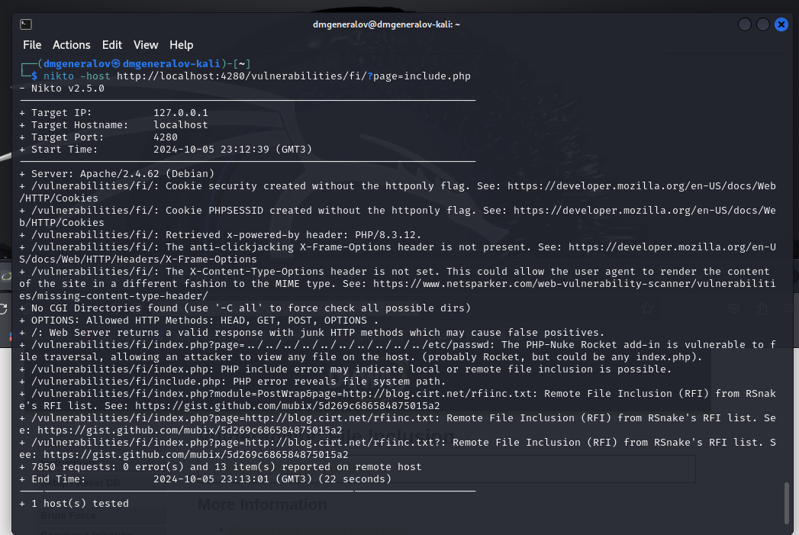

---
## Front matter
title: "Индивидуальный проект 4"
author: "Генералов Даниил, 1032212280"

## Generic otions
lang: ru-RU
toc-title: "Содержание"

## Bibliography
bibliography: bib/cite.bib
csl: pandoc/csl/gost-r-7-0-5-2008-numeric.csl

## Pdf output format
toc: true # Table of contents
toc-depth: 2
lof: true # List of figures
lot: true # List of tables
fontsize: 12pt
linestretch: 1.5
papersize: a4
documentclass: scrreprt
## I18n polyglossia
polyglossia-lang:
  name: russian
  options:
  - spelling=modern
  - babelshorthands=true
polyglossia-otherlangs:
  name: english
## I18n babel
babel-lang: russian
babel-otherlangs: english
## Fonts
mainfont: IBM Plex Serif
romanfont: IBM Plex Serif
sansfont: IBM Plex Sans
monofont: IBM Plex Mono
mathfont: STIX Two Math
mainfontoptions: Ligatures=Common,Ligatures=TeX,Scale=0.94
romanfontoptions: Ligatures=Common,Ligatures=TeX,Scale=0.94
sansfontoptions: Ligatures=Common,Ligatures=TeX,Scale=MatchLowercase,Scale=0.94
monofontoptions: Scale=MatchLowercase,Scale=0.94,FakeStretch=0.9
mathfontoptions:
## Biblatex
biblatex: true
biblio-style: "gost-numeric"
biblatexoptions:
  - parentracker=true
  - backend=biber
  - hyperref=auto
  - language=auto
  - autolang=other*
  - citestyle=gost-numeric
## Pandoc-crossref LaTeX customization
figureTitle: "Рис."
tableTitle: "Таблица"
listingTitle: "Листинг"
lofTitle: "Список иллюстраций"
lotTitle: "Список таблиц"
lolTitle: "Листинги"
## Misc options
indent: true
header-includes:
  - \usepackage{indentfirst}
  - \usepackage{float} # keep figures where there are in the text
  - \floatplacement{figure}{H} # keep figures where there are in the text
---

# Цель работы

В этом этапе индивидуального проекта требуется использовать сканер уязвимостей nikto,
чтобы найти какие-то уязвимости в DVWA.

# Выполнение лабораторной работы

Сканер nikto уже идет в стандартной установке Kali Linux.
Мы просто запускаем его, направляя его на адрес, где развернут DVWA,
и получаем список потенциальных проблем (рис. [-@fig:001]).

{#fig:001 width=70%}

К сожалению, большинство из этих проблем не слишком интересные,
например тот факт что сервер раскрывает версию PHP на которой он работает.

Более интересный вывод можно получить, направив его на какую-то страницу, которая демонстрирует уязвимость.
Например, на странице с SQL-инъекцией, он обнаружил, что может быть что-то интересное в скрипте,
который используется для выдачи данных для формы (рис. [-@fig:002]).

{#fig:002 width=70%}

Также можно найти уязвимость, связанную с подключением файлов:
скрипт include.php может вернуть содержимое файлов в файловой системе (вроде /etc/passwd)
и на HTTP-сайтах (рис. [-@fig:003]).

{#fig:003 width=70%}

Nikto не имеет автоматического рекурсивного сканирования, поэтому можно использовать другую программу, чтобы сгенерировать список всех страниц на сайте,
а затем направить Nikto на каждую страницу и проверить ее;
или в ручном режиме пробовать интересные страниуы.

# Выводы

Мы успешно использовали Nikto, чтобы найти какие-то уязвимости в DVWA,
определить их тип и получить ссылки на источники, где есть информация о том, как их можно исправить.