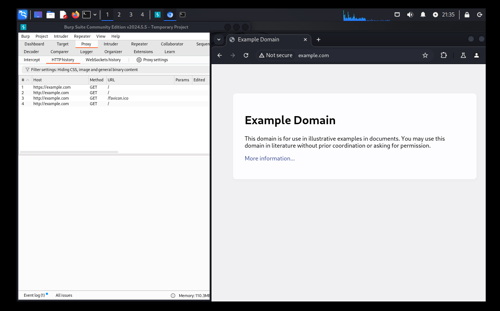
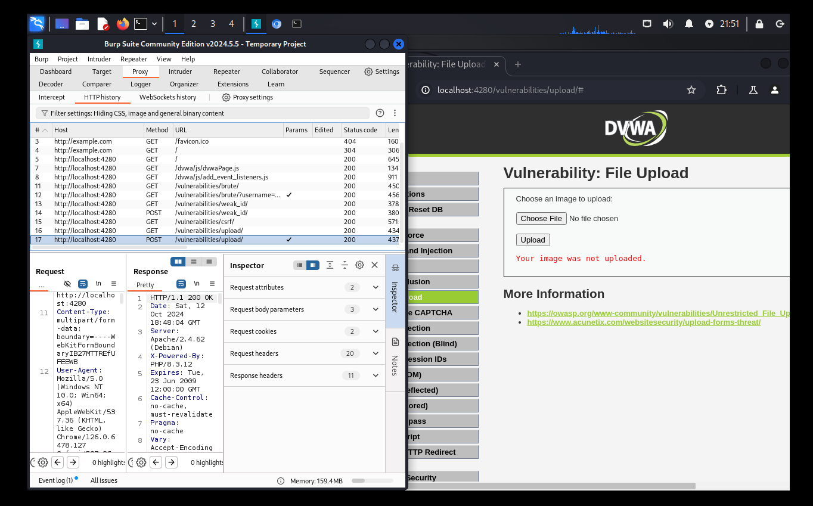
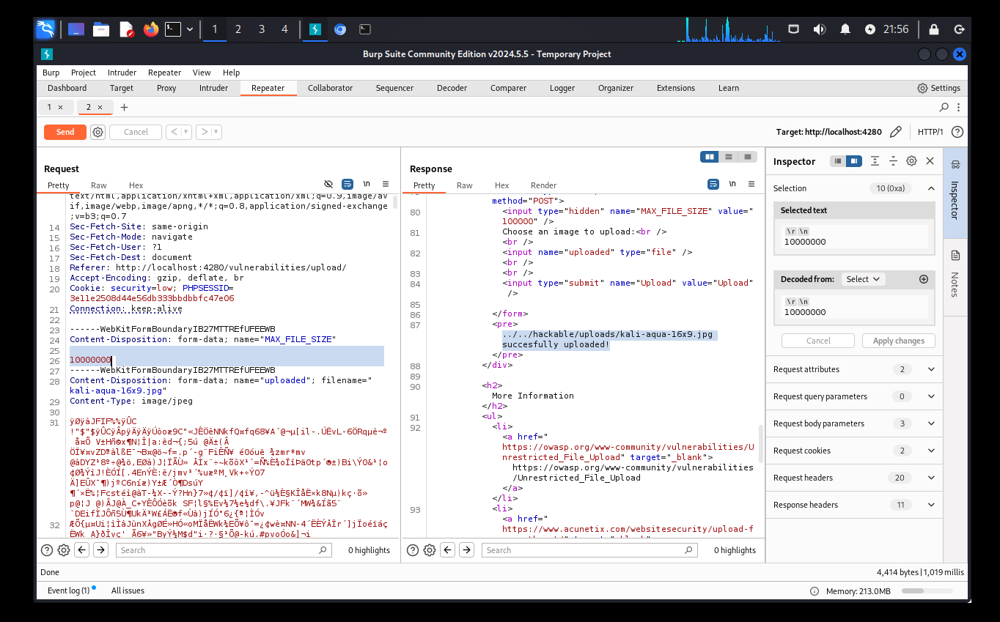
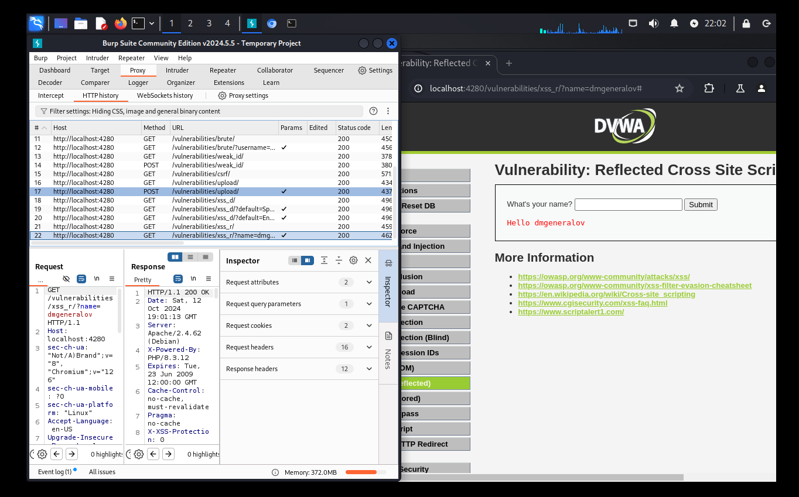
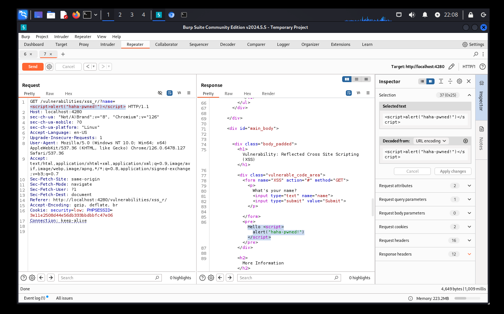
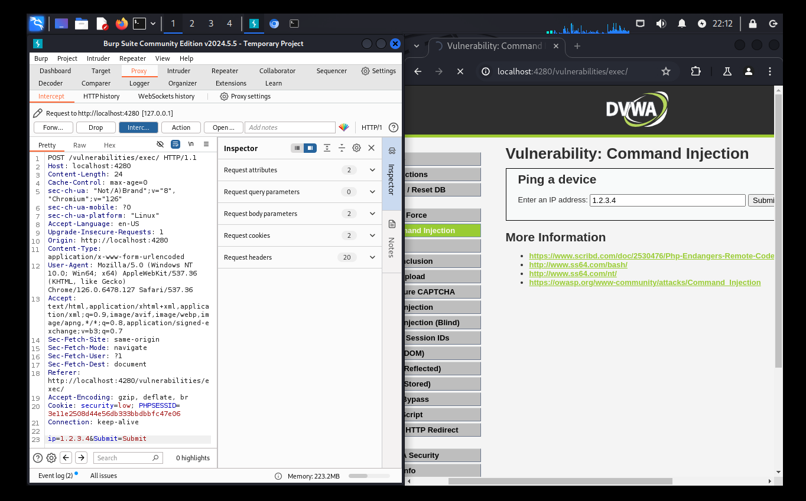
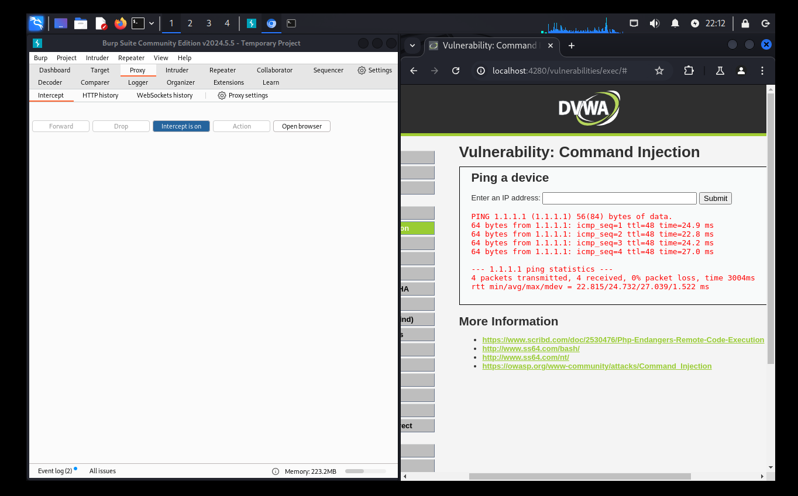

---
## Front matter
lang: ru-RU
title: Индивидуальный проект шаг 5
author:
  - Генералов Даниил, 1032212280
institute:
  - Российский университет дружбы народов, Москва, Россия
date: 2024 г.

## i18n babel
babel-lang: russian
babel-otherlangs: english

## Formatting pdf
toc: false
toc-title: Содержание
slide_level: 2
aspectratio: 169
section-titles: true
theme: metropolis
header-includes:
 - \metroset{progressbar=frametitle,sectionpage=progressbar,numbering=fraction}
---

# Задание

В этом этапе индивидуального проекта требуется использовать набор инструментов Burp Suite,
чтобы найти и использовать какие-то уязвимости в DVWA.

# Выполнение

## Burp Proxy

{#fig:001 width=70%}

## POST-запрос

{#fig:002 width=70%}

## MAX_FILE_SIZE

{#fig:003 width=70%}

## XSS

{#fig:004 width=70%}

## XSS

{#fig:005 width=70%}

## Intercept

{#fig:006 width=70%}

## Intercept

{#fig:007 width=70%}

# Выводы

Мы успешно использовали некоторые из утилит в Burp Suite
для анализа и использования уязвимостей.