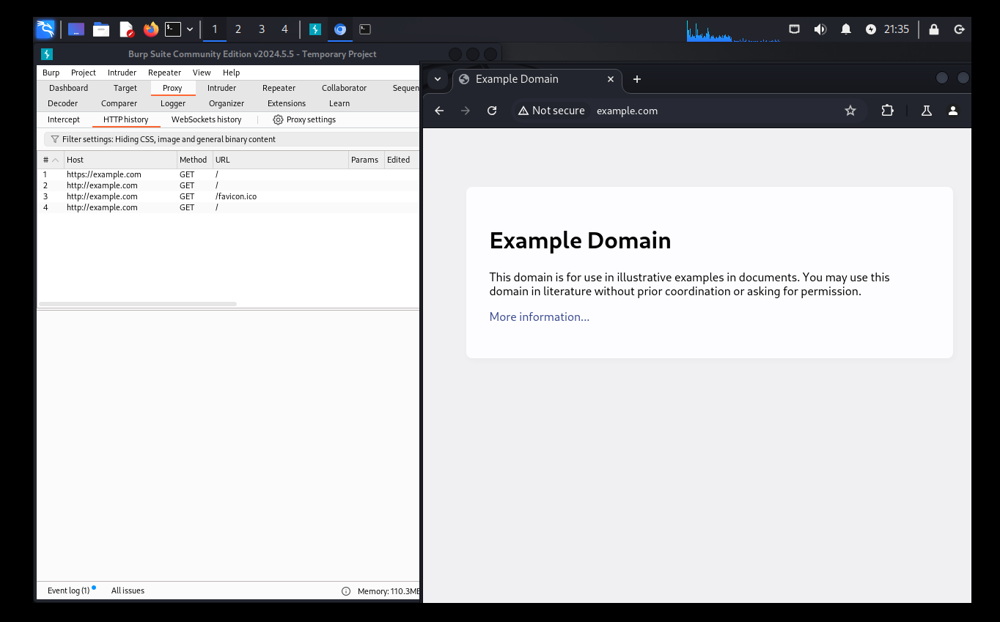
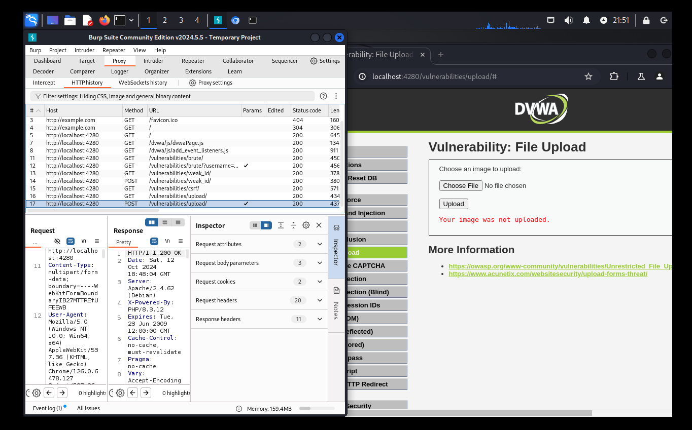
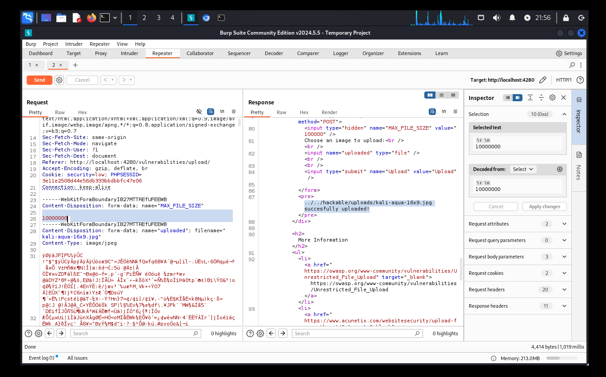
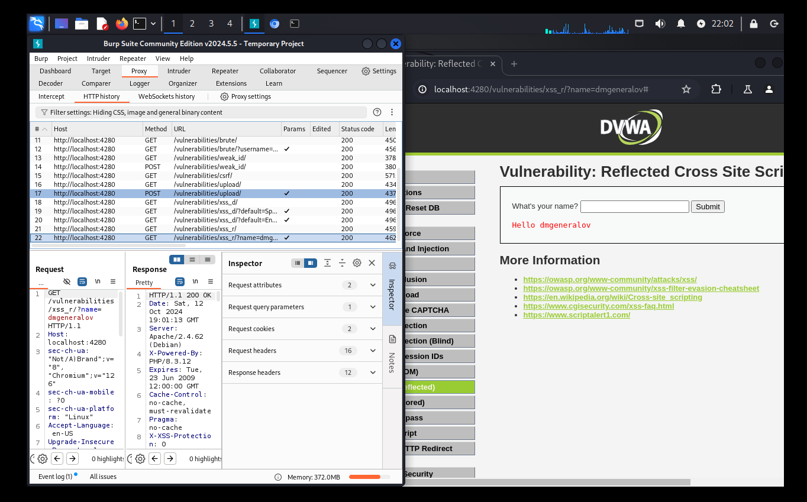
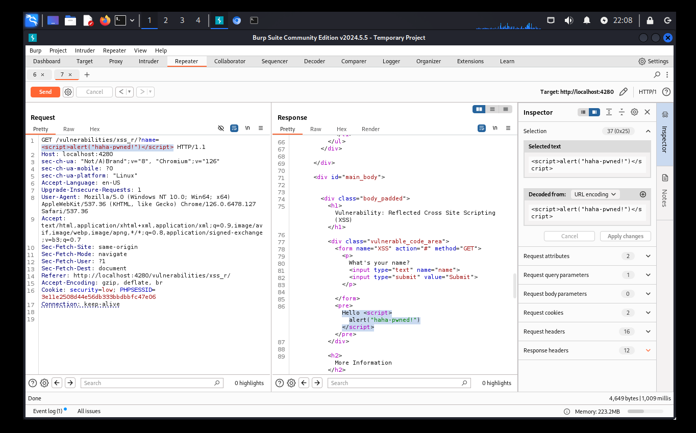
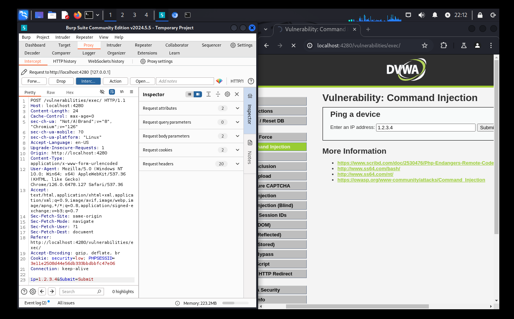
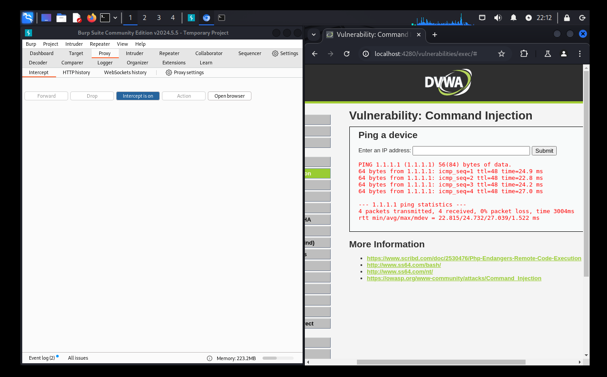

---
## Front matter
title: "Индивидуальный проект 5"
author: "Генералов Даниил, 1032212280"

## Generic otions
lang: ru-RU
toc-title: "Содержание"

## Bibliography
bibliography: bib/cite.bib
csl: pandoc/csl/gost-r-7-0-5-2008-numeric.csl

## Pdf output format
toc: true # Table of contents
toc-depth: 2
lof: true # List of figures
lot: true # List of tables
fontsize: 12pt
linestretch: 1.5
papersize: a4
documentclass: scrreprt
## I18n polyglossia
polyglossia-lang:
  name: russian
  options:
  - spelling=modern
  - babelshorthands=true
polyglossia-otherlangs:
  name: english
## I18n babel
babel-lang: russian
babel-otherlangs: english
## Fonts
mainfont: IBM Plex Serif
romanfont: IBM Plex Serif
sansfont: IBM Plex Sans
monofont: IBM Plex Mono
mathfont: STIX Two Math
mainfontoptions: Ligatures=Common,Ligatures=TeX,Scale=0.94
romanfontoptions: Ligatures=Common,Ligatures=TeX,Scale=0.94
sansfontoptions: Ligatures=Common,Ligatures=TeX,Scale=MatchLowercase,Scale=0.94
monofontoptions: Scale=MatchLowercase,Scale=0.94,FakeStretch=0.9
mathfontoptions:
## Biblatex
biblatex: true
biblio-style: "gost-numeric"
biblatexoptions:
  - parentracker=true
  - backend=biber
  - hyperref=auto
  - language=auto
  - autolang=other*
  - citestyle=gost-numeric
## Pandoc-crossref LaTeX customization
figureTitle: "Рис."
tableTitle: "Таблица"
listingTitle: "Листинг"
lofTitle: "Список иллюстраций"
lotTitle: "Список таблиц"
lolTitle: "Листинги"
## Misc options
indent: true
header-includes:
  - \usepackage{indentfirst}
  - \usepackage{float} # keep figures where there are in the text
  - \floatplacement{figure}{H} # keep figures where there are in the text
---

# Цель работы

В этом этапе индивидуального проекта требуется использовать набор инструментов Burp Suite,
чтобы найти и использовать какие-то уязвимости в DVWA.

# Выполнение лабораторной работы

Burp Suite -- набор инструментов для кибербезопасности,
которые работают вместе.
Изучение цели начинается с Burp Proxy:
он используется, чтобы получить трафик для анализа.
Используя встроенный браузер,
можно собрать информацию о тех веб-запросах,
которые выполняет приложение
(рис. [-@fig:001]).

{#fig:001 width=70%}

Это можно использовать, чтобы отследить, какие запросы происходят.
Например, можно увидеть содержимое этого POST-запроса, который используется для загрузки файлов на сервер
(рис. [-@fig:002]).

{#fig:002 width=70%}

Теперь можно отправить этот запрос в вкладку Repeater,
где можно отредактировать и выполнить этот запрос еще раз.
Мы видим, что в этом запросе передается параметр MAX_FILE_SIZE:
если его отредактировать, то наш файл будет успешно загружен
(рис. [-@fig:003]).

{#fig:003 width=70%}

С помощью этого инструмента можно легко эксплуатировать любые уязвимости, связанные с редактированием
данных запроса.
Например, можно использовать его для эксплуатирования reflected XSS:
сначала мы записываем запрос, который используется на странице (рис. [-@fig:004]).

{#fig:004 width=70%}

После этого мы открываем его в вкладке Repeater,
и меняем GET-параметр:
мы видим, что он появляется в явном виде на странице (рис. [-@fig:005]),
что значит, что если перейти на ссылку специального формата, то злоумышленник может добавить свой код на страницу.

{#fig:005 width=70%}

Одна из очень полезных фич Burp Proxy -- возможность интерактивного редактирования запросов.
Если включить режим Intercept, то после того, как клиент отправил запрос,
но до того, как он был передан серверу,
можно отредактировать этот запрос.
Например, клиент сделал ping на адрес 1.2.3.4 (рис. [-@fig:006]),
а получил ответ с ping на 1.1.1.1 (рис. [-@fig:007]).

{#fig:006 width=70%}

{#fig:007 width=70%}

# Выводы

Мы успешно использовали некоторые из утилит в Burp Suite
для анализа и использования уязвимостей.